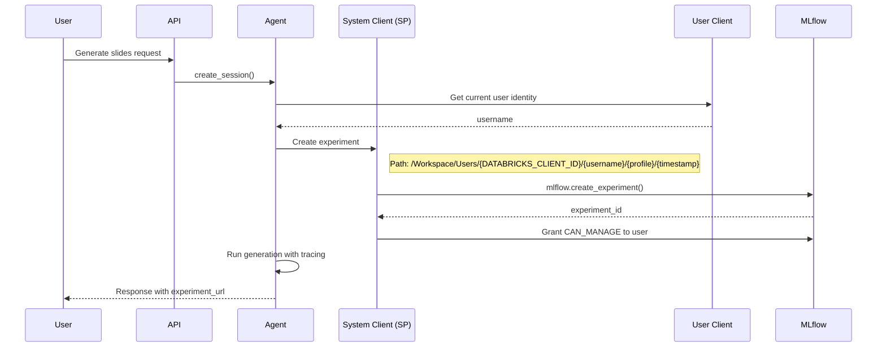

# MLflow Per-Session Experiment Architecture

## Problem Statement

The current implementation has a limitation with how user and service principal clients interact with MLflow:

- Experiments are created in user workspace folders (`/Workspace/Users/{username}/ai-slide-generator`)
- The app service principal may not have write access to user folders
- Users cannot access experiments created by the service principal in its folder
- Single shared experiment per profile doesn't isolate user sessions

## New Architecture



**Experiment Path Format:**

```
/Workspace/Users/{DATABRICKS_CLIENT_ID}/{user_name}/{profile_name}/{timestamp}
```

Where `DATABRICKS_CLIENT_ID` is the app service principal's client ID from the environment variable.

## Key Changes

### 1. Get Service Principal Client ID ([`src/core/databricks_client.py`](src/core/databricks_client.py))

Add a function to get the service principal's client ID from environment:

```python
def get_service_principal_client_id() -> str:
    """Get the app service principal's client ID from environment."""
    client_id = os.getenv("DATABRICKS_CLIENT_ID")
    if not client_id:
        raise DatabricksClientError("DATABRICKS_CLIENT_ID environment variable not set")
    return client_id

def get_service_principal_folder() -> str:
    """Get the workspace folder path for the app service principal."""
    client_id = get_service_principal_client_id()
    return f"/Workspace/Users/{client_id}"
```

### 2. Refactor MLflow Setup ([`src/services/agent.py`](src/services/agent.py))

Move experiment creation from `__init__` to `create_session()`:

- Remove `_setup_mlflow()` from `__init__`
- Create experiment per-session in `create_session()` with the new path format
- Grant permissions to the user after experiment creation
```python
def _create_experiment_for_session(self, session_id: str, username: str) -> str:
    """Create a new MLflow experiment for this session with user permissions."""
    from src.core.databricks_client import get_service_principal_folder, get_system_client
    
    sp_folder = get_service_principal_folder()
    timestamp = datetime.utcnow().strftime("%Y%m%d_%H%M%S")
    experiment_path = f"{sp_folder}/{username}/{self.settings.profile_name}/{timestamp}"
    
    # Create experiment using system client context
    experiment_id = mlflow.create_experiment(experiment_path)
    
    # Grant CAN_MANAGE to the user
    self._grant_experiment_permission(experiment_id, username, "CAN_MANAGE")
    
    return experiment_id
```


### 3. Grant Experiment Permissions

Use the Databricks Workspace API to grant permissions:

```python
def _grant_experiment_permission(self, experiment_id: str, username: str, permission: str) -> None:
    """Grant permission on experiment to user via Databricks API."""
    client = get_system_client()
    # Use workspace permissions API
    client.experiments.set_experiment_permissions(
        experiment_id=experiment_id,
        access_control_list=[
            ExperimentAccessControlRequest(
                user_name=username,
                permission_level=ExperimentPermissionLevel.CAN_MANAGE
            )
        ]
    )
```

### 4. Session-Scoped Experiment Context

Store experiment_id in session data and use it for tracing:

```python
# In create_session():
self.sessions[session_id] = {
    "chat_history": chat_history,
    "genie_conversation_id": genie_conversation_id,
    "experiment_id": experiment_id,  # NEW
    "username": username,             # NEW
    ...
}

# In generate_slides():
mlflow.set_experiment(experiment_id=session["experiment_id"])
with mlflow.start_span(...):
    ...
```

### 5. Remove Static MLflow Config from Profiles

The MLflow experiment_name in profile config becomes obsolete since experiments are now created dynamically per-session. Options:

- Keep for backward compatibility but ignore
- Remove from database schema and UI

### 6. Frontend: Add Run Details Link ([`frontend/src/components/Layout/AppLayout.tsx`](frontend/src/components/Layout/AppLayout.tsx))

Add a "Run Details" link in the header, next to the session name and slide count (lines 103-113):

```tsx
<p className="text-sm text-blue-100 flex items-center gap-2">
  {sessionTitle && (
    <>
      <span className="truncate max-w-[200px]" title={sessionTitle}>
        {sessionTitle}
      </span>
      <span className="text-blue-300">•</span>
    </>
  )}
  {slideDeck ? `${slideDeck.slide_count} slides` : 'No slides'}
  {experimentUrl && (
    <>
      <span className="text-blue-300">•</span>
      <a 
        href={experimentUrl} 
        target="_blank" 
        rel="noopener noreferrer"
        className="hover:text-white underline"
      >
        Run Details
      </a>
    </>
  )}
</p>
```

**Data flow for experiment URL:**

1. Agent returns `experiment_url` in generation response
2. Store in session context or generation state
3. Pass to AppLayout header for display

### 7. Update Technical Documentation

Update the following docs in [`docs/technical/`](docs/technical/):

- [`backend-overview.md`](docs/technical/backend-overview.md) - MLflow architecture section
- [`database-configuration.md`](docs/technical/database-configuration.md) - Note MLflow config is now per-session
- [`configuration-validation.md`](docs/technical/configuration-validation.md) - Update MLflow validation description

## Files to Modify

| File | Changes |

|------|---------|

| [`src/core/databricks_client.py`](src/core/databricks_client.py) | Add `get_service_principal_client_id()` and `get_service_principal_folder()` |

| [`src/services/agent.py`](src/services/agent.py) | Refactor `_setup_mlflow()`, add per-session experiment creation with permissions, return experiment_url |

| [`src/api/routes/generate.py`](src/api/routes/generate.py) | Pass username to agent, return experiment_url in response |

| [`frontend/src/components/Layout/AppLayout.tsx`](frontend/src/components/Layout/AppLayout.tsx) | Add "Run Details" link in header |

| [`frontend/src/contexts/SessionContext.tsx`](frontend/src/contexts/SessionContext.tsx) | Store experiment_url in session state |

| [`docs/technical/backend-overview.md`](docs/technical/backend-overview.md) | Update MLflow architecture section |

| [`docs/technical/database-configuration.md`](docs/technical/database-configuration.md) | Note MLflow experiment_name is legacy |

| [`docs/technical/configuration-validation.md`](docs/technical/configuration-validation.md) | Update validation description |

## API Response Changes

The generate endpoint should return the experiment URL:

```python
# In generate response:
{
    "html": "...",
    "session_id": "...",
    "experiment_url": "https://{DATABRICKS_HOST}/ml/experiments/{experiment_id}"
}
```

## Dependencies

- Databricks SDK `experiments.set_experiment_permissions()` or equivalent API
- MLflow tracing must support experiment switching mid-process
- Environment variable: `DATABRICKS_CLIENT_ID` (app service principal client ID)

## Testing Considerations

- Verify service principal has permissions to create experiments in its folder
- Verify user can access their experiments after permission grant
- Test experiment isolation between users/sessions
- Verify "Run Details" link opens correct experiment in new tab