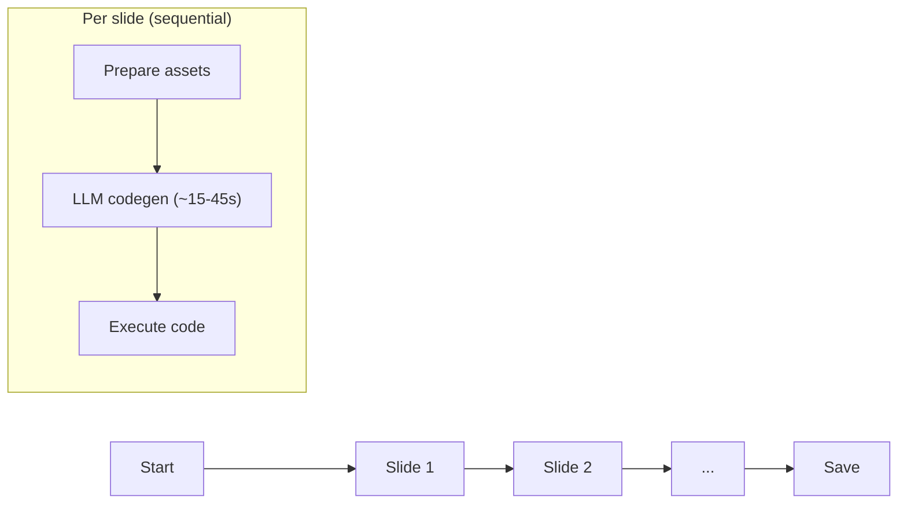
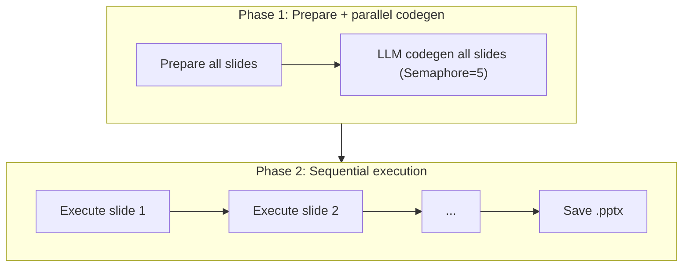

# GSlides Prompts + PPTX Parallelization Design Spec

**Date:** 2026-03-31
**Status:** Completed

## Overview

Two related improvements to the export pipeline:

1. **Google Slides prompt enrichment** — The PPTX export prompts contain significantly more detail for color extraction, tables, imports, API error prevention, and bullet lists. The Google Slides prompts are sparse in these areas, causing lower-fidelity output. This spec adds the missing patterns to `_GSLIDES_SHARED_RULES`.

2. **PPTX export parallelization** — The Google Slides export already uses a two-phase pipeline (parallel LLM codegen → sequential execution) achieving 3–5x speedup. The PPTX export path still processes slides sequentially. This spec applies the same proven pattern to `html_to_pptx.py`.

## Goals

- Improve Google Slides export fidelity by closing the prompt gap with PPTX
- Reduce PPTX export time from ~150–450s to ~35–95s for a 10-slide deck (3–5x speedup)
- Provide real-time progress reporting during both codegen and execution phases
- Maintain thread safety — the `Presentation` object is never mutated concurrently

## Non-Goals

- No changes to the HTML-to-slide conversion logic itself
- No changes to the Google Slides converter code (only prompts change)
- No changes to the frontend export UI
- No new LLM endpoints or model changes

---

## Design Decisions

| # | Decision | Choice | Rationale |
|---|----------|--------|-----------|
| 1 | Parallelization strategy | Two-phase: parallel codegen + sequential execution | Proven in Google Slides path; `Presentation` object is not thread-safe |
| 2 | Concurrency limit | `Semaphore(5)` | Matches Google Slides; prevents LLM endpoint overload |
| 3 | LLM timeout | 300s per call | Matches Google Slides; prevents hung exports |
| 4 | Prompt enrichment scope | Additive only — no existing rules removed | Minimizes regression risk; LLM handles additional context well within token limits |
| 5 | `_call_llm` refactor | Split into `_call_llm_sync` + async wrapper | Blocking HTTP call needs `asyncio.to_thread`; wrapper preserves backward compat |
| 6 | Progress reporting | Two-phase messages: "Generating code: X/Y" then "Building slide X/Y" | Gives users visibility into both phases; matches Google Slides pattern |

---

## Part 1: Google Slides Prompt Enrichment

### File: `src/services/google_slides_prompts_defaults.py`

All changes are additive to `_GSLIDES_SHARED_RULES` and `DEFAULT_GSLIDES_SYSTEM_PROMPT`.

### Enrichments

#### 1. Color Extraction and Gradients

Currently only in PPTX prompts. Add explicit section:

- Gradient handling: "use first color"
- "Preserve all badge/border/highlight colors"
- Canonical `hex_to_rgb('#XXXXXX')` as the standard conversion

#### 2. Table Improvements

Current GSlides table guidance (lines 62–68) is minimal. Bring closer to PPTX:

- Badge/span handling (`lob-badge` class)
- Row height minimum / column width distribution
- Border and row-striping (`updateTableCellProperties` for alternating fills)
- "NEVER insertText with empty string into table cells — skip the cell"

#### 3. Text in Shapes — Autofit / Word Wrap

PPTX uses `word_wrap=True` on every text frame. Google Slides API supports `autofit`. Add:

- "Use autofit: NONE for shapes with precise layout (metric cards, badges)"
- "Ensure text does not overflow by reducing font size rather than growing the box"

#### 4. Explicit Allowed Imports

Replace negative "Do NOT import" guidance with a positive allowlist:

```
ALLOWED imports:
import os, json, uuid, re
from googleapiclient.http import MediaFileUpload  # ONLY for image uploads
```

Aligns with what `_prepare_code` injects and reduces import-related errors.

#### 5. API Error Prevention Patterns

New section in `_GSLIDES_SHARED_RULES`:

- "Never reference an objectId before the request that creates it"
- "Batch request order must match dependency order (create shape before styling it)"
- "Never insertText with empty string"
- "When computing EMU values, always use `emu()` helper — do not mix raw floats"

#### 6. Bullet / List Paragraphs

HTML `<ul>/<ol>` lists need `updateParagraphStyle` with bullet presets and `indentStart`/`indentFirstLine`. 3–4 lines of guidance.

#### 7. Mini Worked Examples

Compact inline examples for the two most error-prone patterns:

- **Table cell fill**: 2-line pseudocode showing `insertText` on a cell + `updateTextStyle` with `tableRange`
- **Hyperlink with two text segments**: Show `startIndex`/`endIndex` tracking after sequential `insertText` calls

### Prompt Length Impact

Additional content is ~40–60 lines. With 16K `max_tokens` and 10K thinking budget, well within limits.

---

## Part 2: PPTX Export Parallelization

### Current Flow (Sequential)



For a 10-slide deck: ~150–450s total (LLM calls dominate).

### Target Flow (Parallel Codegen + Sequential Execution)



For a 10-slide deck: ~30–90s codegen (bounded by longest + semaphore) + ~2–5s execution = ~35–95s total. **3–5x speedup.**

### Refactored Method Structure

#### New/refactored methods in `html_to_pptx.py`:

| Method | Type | Purpose |
|--------|------|---------|
| `_call_llm_sync` | Sync | Blocking HTTP call with `timeout=300` |
| `_call_llm` | Async | Thin wrapper via `asyncio.to_thread` (backward compat) |
| `_prepare_slide` | Sync | Extract asset preparation from `_add_slide_to_presentation` |
| `_generate_code_sync` | Sync | Build prompt + call `_call_llm_sync` + return code |
| `_generate_all_codes` | Async | Semaphore-bounded parallel dispatch via `asyncio.gather` |
| `_execute_slide` | Sync | Execute generated code against `Presentation` + fallback |

#### `convert_slide_deck` rewrite:

```python
async def convert_slide_deck(self, slides, ...):
    prs = Presentation(template)

    # Phase 1: Prepare + parallel codegen
    slide_inputs = []
    for i, slide_html in enumerate(slides):
        prepared = self._prepare_slide(slide_html, chart_images, i + 1)
        slide_inputs.append(prepared)

    codes = await self._generate_all_codes(slide_inputs, on_codegen_progress=progress_cb)

    # Phase 2: Sequential execution
    for i, (code, prepared) in enumerate(zip(codes, slide_inputs)):
        self._execute_slide(code, prs, prepared["html"], prepared["assets_dir"], i + 1)

    prs.save(output_path)
```

### Export Job Queue Changes

**File: `src/api/services/export_job_queue.py`**

`convert_slides_with_progress` rewritten as two-phase:

- **Phase 1:** Prepare all slides, parallel codegen with `status_message` updates: `"Generating code: X/Y slides ready..."`
- **Phase 2:** Sequential execution with `status_message` updates: `"Building slide X/Y..."`

Mirrors the Google Slides path's progress reporting.

---

## Thread Safety

The `Presentation` object from `python-pptx` is **not thread-safe**. The design ensures:

- **Phase 1 (parallel):** Only LLM HTTP calls run concurrently — no `Presentation` access
- **Phase 2 (sequential):** Code execution runs one slide at a time against the `Presentation` object

No concurrent mutation of shared state.

---

## Testing Strategy

### Unit Tests

- Existing PPTX converter tests must pass unchanged (refactored internals, same external behavior)
- Existing Google Slides converter tests must pass unchanged (prompt changes are additive)

### Integration Verification

- Export a 10-slide deck via PPTX — verify output quality matches pre-refactor
- Export via Google Slides — verify prompt enrichments improve output (manual check)
- Verify progress messages appear correctly in export UI for both phases

---

## Files Modified

| File | Change |
|------|--------|
| `src/services/google_slides_prompts_defaults.py` | Enrich `_GSLIDES_SHARED_RULES` with color/table/import/API/bullet/example patterns |
| `src/services/html_to_pptx.py` | Add parallel codegen infrastructure, refactor into two-phase pipeline |
| `src/api/services/export_job_queue.py` | Update `convert_slides_with_progress` to two-phase with progress messages |

## Files NOT Modified

| File | Reason |
|------|--------|
| `src/services/html_to_google_slides.py` | Already uses two-phase pattern — no changes needed |
| Frontend export components | No UI changes — progress messages already rendered |
| Database schema | No migrations |

---

## Risks and Mitigations

| Risk | Mitigation |
|------|-----------|
| `Presentation` object concurrent mutation | Only code generation runs in parallel; execution is sequential — no concurrent mutation |
| LLM timeout under concurrent load | `timeout=300` per call, matching Google Slides; `Semaphore(5)` limits concurrent requests |
| Prompt length increase for Google Slides | Additional ~40–60 lines; well within 16K `max_tokens` + 10K thinking budget |
| Regression in PPTX output quality | Refactored helpers produce identical output to the original sequential path; same LLM calls, same execution logic |
| Google Slides prompt regression | All changes are additive — no existing rules modified or removed |
