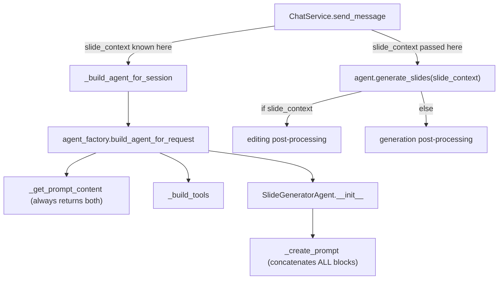
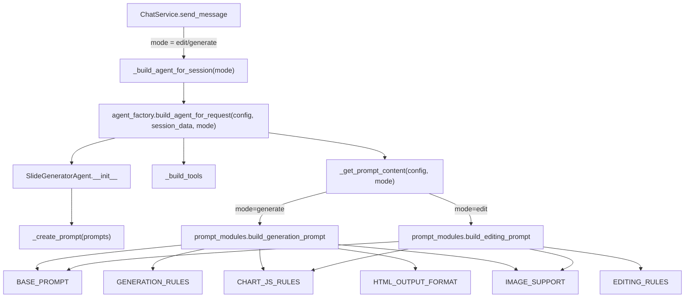

# Prompt Mode Decoupling Design Spec

**Date:** 2026-03-31
**Status:** Completed

## Overview

Decouple the monolithic system prompt into composable prompt modules and introduce mode-aware agent construction. Today, the agent receives a single concatenated prompt containing both generation rules (~107 lines) and editing rules (~73 lines, ~2,200 tokens) regardless of the actual operation. This wastes context window, confuses the LLM, and tightly couples the two modes.

After this change, the factory determines `mode` ("generate" or "edit") before building the agent and assembles only the relevant prompt blocks.

## Goals

- Eliminate ~2,200 tokens of irrelevant editing instructions from generation requests (and vice versa)
- Reduce prompt confusion by giving the LLM only the rules for its current task
- Enable independent tuning of generation vs editing prompts without regression risk
- Preserve backward compatibility for custom prompt overrides and the legacy concatenation path

## Non-Goals

- No changes to the LLM endpoint or model configuration
- No changes to tool construction or Genie integration
- No frontend changes (mode is determined server-side from slide_context presence)
- No database schema changes — `ConfigPrompts.system_prompt` and `ConfigPrompts.slide_editing_instructions` columns preserved

---

## Design Decisions

| # | Decision | Choice | Rationale |
|---|----------|--------|-----------|
| 1 | Where to determine mode | ChatService, before `_build_agent_for_session` | `slide_context` is already known at this point; avoids building an agent with the wrong prompt |
| 2 | How to handle RC13 late `slide_context` | Move RC13 detection before agent build (Option A) | RC13 only reads deck state and parsed intent — no side effects, safe to reorder |
| 3 | Custom prompt overrides | Bypass modular assembly entirely | Users who set `config.system_prompt` take full control — same behavior as today |
| 4 | Legacy backward compat | Preserve old `_create_prompt` concatenation path | `pre_built_prompts=None` triggers legacy path — no breakage for existing agent construction |
| 5 | IMAGE_SUPPORT location | Move from `agent.py` to `prompt_modules.py` | Consolidates all prompt content into one module |
| 6 | `slide_editing_instructions` key | Set to `None` in new path | Editing rules are baked into the assembled system prompt; the key becomes vestigial |

---

## Architecture

### Current Flow (Monolithic)



**Problem:** The mode is determined inside `generate_slides()` *after* the agent is built. The prompt always contains both generation and editing instructions.

### New Flow (Mode-Aware)



**Key change:** `ChatService` determines the mode *before* building the agent. The factory calls the appropriate assembly function. The agent receives a pre-assembled, mode-specific prompt.

---

## Prompt Module Structure

### Module Blocks

Extracted verbatim from the current monolithic `system_prompt` in `defaults.py` (lines 41–148) and `slide_editing_instructions` (lines 150–223):

| Block | Source | Used by Generation | Used by Editing |
|-------|--------|-------------------|-----------------|
| `BASE_PROMPT` | Lines 41–50: role definition + multi-turn support | Yes | Yes |
| `DATA_ANALYSIS_GUIDELINES` | Lines 62–68: data analysis approach | Yes | Yes |
| `GENERATION_RULES` | Lines 51–61 + 70–95: presentation creation, slide-level guidelines | Yes | No |
| `CHART_JS_RULES` | Lines 96–115: Chart.js technical requirements | Yes | Yes |
| `HTML_OUTPUT_FORMAT` | Lines 116–148: HTML5 requirements + DOCTYPE format | Yes | No |
| `EDITING_RULES` | Lines 150–223: replacement HTML format, operation types | No | Yes |
| `EDITING_OUTPUT_FORMAT` | New: "Return only `<div class='slide'>` fragments" | No | Yes |
| `IMAGE_SUPPORT` | From `agent.py::_create_prompt` | Yes | Yes |

### Assembly Functions

```python
def build_generation_system_prompt(
    deck_prompt: str | None = None,
    slide_style: str | None = None,
    image_guidelines: str | None = None,
) -> str:
    """Assemble prompt for generation mode."""
    # [deck_prompt] + slide_style + BASE_PROMPT + DATA_ANALYSIS_GUIDELINES
    # + GENERATION_RULES + CHART_JS_RULES + HTML_OUTPUT_FORMAT + IMAGE_SUPPORT


def build_editing_system_prompt(
    deck_prompt: str | None = None,
    slide_style: str | None = None,
    image_guidelines: str | None = None,
) -> str:
    """Assemble prompt for editing mode."""
    # [deck_prompt] + slide_style + BASE_PROMPT + DATA_ANALYSIS_GUIDELINES
    # + EDITING_RULES + EDITING_OUTPUT_FORMAT + CHART_JS_RULES + IMAGE_SUPPORT
```

---

## Factory Chain Changes

### `agent_factory.py`

```python
def build_agent_for_request(
    agent_config: AgentConfig,
    session_data: dict,
    mode: str = "generate",  # NEW
) -> SlideGeneratorAgent:
    ...

def _get_prompt_content(
    config: AgentConfig,
    mode: str = "generate",  # NEW
) -> dict:
    if config.system_prompt:
        return {"system_prompt": config.system_prompt, "slide_editing_instructions": None}

    if mode == "edit":
        prompt = build_editing_system_prompt(deck_prompt=..., slide_style=..., image_guidelines=...)
    else:
        prompt = build_generation_system_prompt(deck_prompt=..., slide_style=..., image_guidelines=...)

    return {"system_prompt": prompt, "slide_editing_instructions": None}
```

### `chat_service.py`

```python
async def send_message(self, ...):
    # RC13 slide_context synthesis moved HERE (before agent build)
    slide_context = self._resolve_slide_context(...)
    mode = "edit" if slide_context else "generate"
    agent = await self._build_agent_for_session(session, mode=mode)
    ...
```

### `agent.py` — `_create_prompt`

```python
def _create_prompt(self, prompts: dict) -> ChatPromptTemplate:
    system_prompt = prompts.get("system_prompt", "")
    # New path: prompt is pre-assembled, use directly
    # Legacy path: concatenate blocks (when pre_built_prompts is None)
    ...
```

---

## Custom Prompt Override Behavior

| Scenario | Behavior |
|----------|----------|
| `config.system_prompt` is set | Used as-is — modular assembly skipped entirely |
| `config.slide_editing_instructions` is set, mode is "edit" | Substitutes the `EDITING_RULES` module during assembly |
| Neither is set | Full modular assembly based on mode |

---

## Testing Strategy

### Unit Tests

**`tests/unit/test_prompt_modules.py`** (new):
- `build_generation_system_prompt` includes generation rules and `<!DOCTYPE html>`, excludes editing rules
- `build_editing_system_prompt` includes editing rules and editing output format, excludes `<!DOCTYPE html>`
- Both include shared blocks (BASE_PROMPT, CHART_JS_RULES, IMAGE_SUPPORT)
- Optional `deck_prompt` and `image_guidelines` inclusion
- Combined prompts cover all lines of the original monolithic prompt

**`tests/unit/test_agent_factory.py`** (modified):
- `test_build_agent_generate_mode` — editing instructions absent from prompt
- `test_build_agent_edit_mode` — generation-only rules absent from prompt
- `test_custom_system_prompt_bypasses_modules` — user override works

### Existing Tests

All existing tests must pass unchanged. The legacy concatenation path is preserved for backward compatibility.

---

## Files Modified

### New Files
| File | Purpose |
|------|---------|
| `src/core/prompt_modules.py` | Modular prompt blocks + assembly functions |
| `tests/unit/test_prompt_modules.py` | Unit tests for prompt assembly |

### Modified Files
| File | Change |
|------|--------|
| `src/services/agent_factory.py` | Accept `mode`, call prompt_modules assembly |
| `src/services/agent.py` | Simplify `_create_prompt` for pre-assembled path |
| `src/api/services/chat_service.py` | Determine mode early, pass to factory, move RC13 up |
| `tests/unit/test_agent_factory.py` | Add mode-aware tests |

### Unchanged Files
| File | Reason |
|------|--------|
| `src/core/defaults.py` | Preserved for backward compat / DB seeds / legacy path |
| `src/api/schemas/agent_config.py` | `system_prompt` and `slide_editing_instructions` fields unchanged |
| Database schema | No migrations — columns preserved |

---

## Risks and Mitigations

| Risk | Mitigation |
|------|-----------|
| Prompt regression from extraction | New modular blocks extracted verbatim; test asserts combined coverage matches original |
| RC13 ordering change | RC13 only reads existing deck state and parsed intent — no side effects |
| Backward compatibility | Legacy path (`pre_built_prompts=None`) is untouched; `defaults.py` values remain the fallback |
| Custom override breakage | Custom `system_prompt` bypasses modular assembly entirely — same behavior as before |
