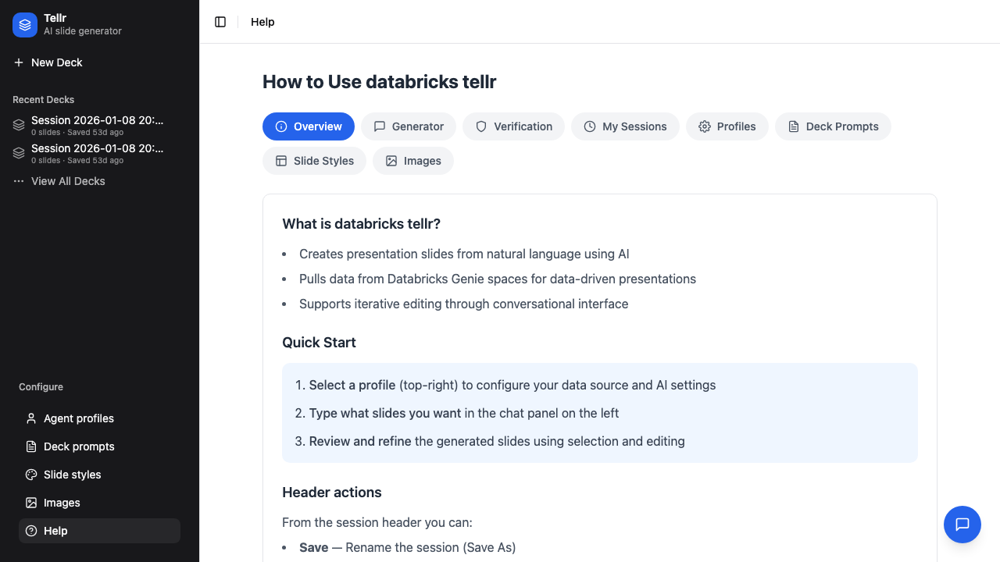
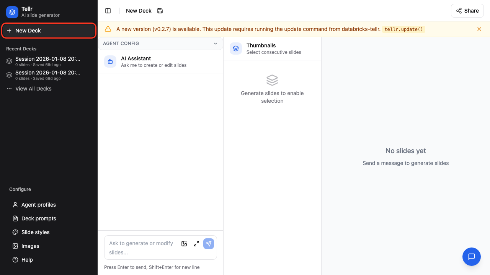
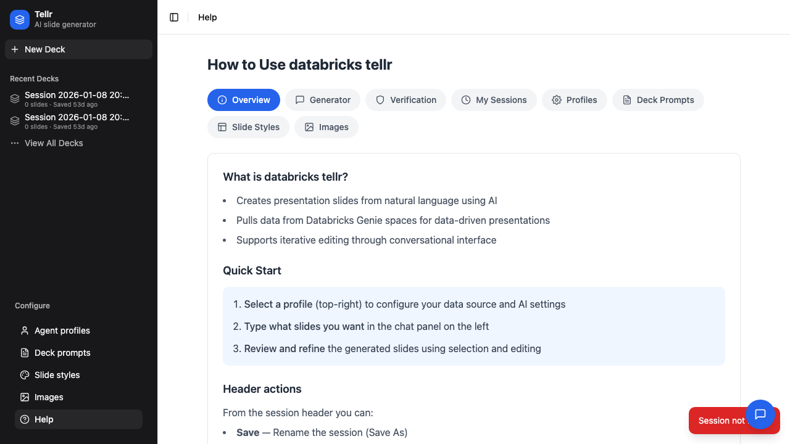
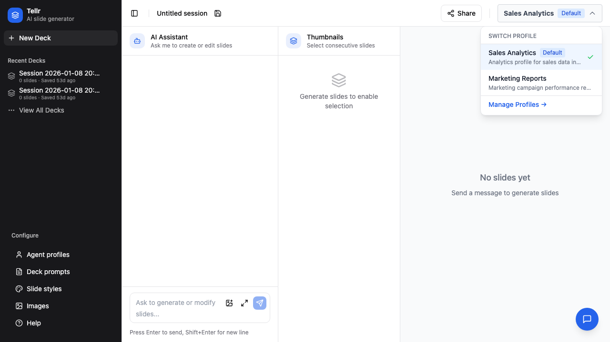
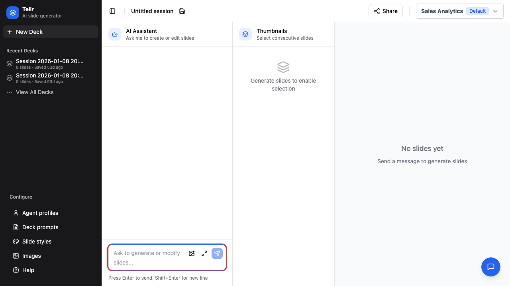
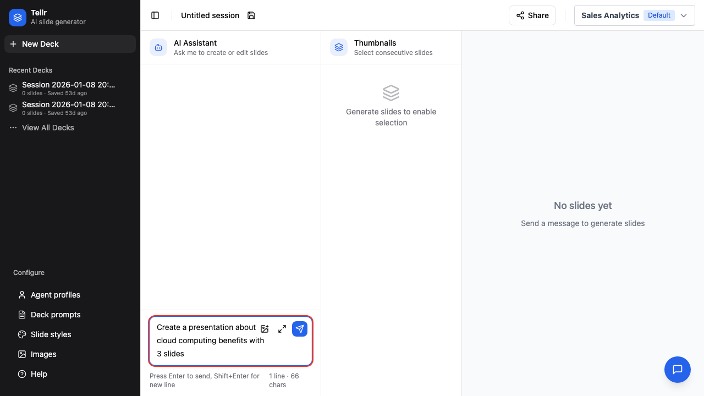
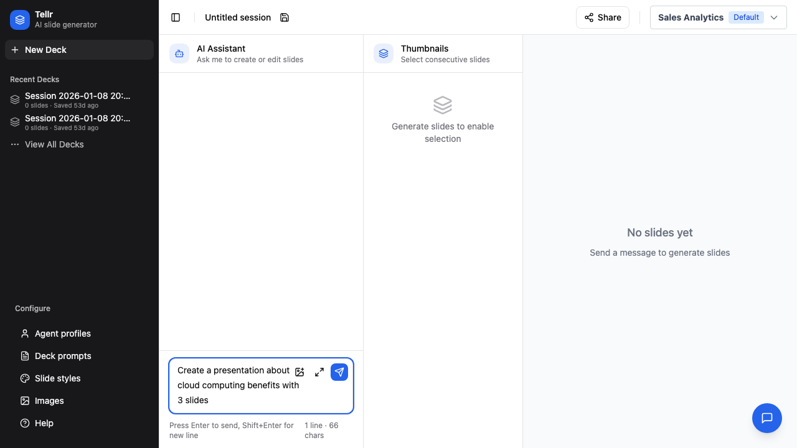

# Generating Slides

This guide walks you through creating AI-generated presentations using Databricks Tellr.

## Overview

The slide generation workflow allows you to:
- Create presentations from natural language prompts
- Pull live data from connected Genie rooms
- Iteratively refine slides through conversation
- Export to PowerPoint, PDF, or HTML

## Prerequisites

- Access to the Databricks Tellr application
- At least one configured profile (see [Creating Profiles](./02-creating-profiles.md))
- A Genie room with relevant data (optional, for data-driven slides)

## Step-by-Step Instructions

### Step 01: Open the App

Navigate to the application URL. You'll see the main navigation and the Help page by default.

### Step 02: Navigate to Generator

Click "Generator" in the navigation bar to access the slide generation interface.

### Step 03: Check Your Profile

The current profile is displayed in the header. This determines which Genie room, slide style, and deck prompt are used.

### Step 04: Change Profile (if needed)

Click the profile button to see available profiles and switch if needed.

### Step 05: Enter Your Prompt

Click in the chat input area at the bottom of the screen.

### Step 06: Describe Your Presentation

Type a clear, specific prompt describing what you want:
- Topic and scope
- Number of slides (optional)
- Data to include (if using Genie)
- Any specific requirements

### Step 07: Send Your Request

Click the Send button or press Enter to start generation.

## Iterating on Your Slides

After slides are generated, they appear in the right panel. You can see progress in the chat panel as slides stream in.

After initial generation, you can refine selected slides through conversation:

| Action | Example Prompt |
|--------|----------------|
| Edit a slide contents | "Change title to 'Q4 Results'" |
| Add a slide | "Add a new slide about {X} after this one" |
| Regenerate all | "Regenerate all slides with more data" |

## Selecting Specific Slides

Click the checkbox on individual slides to select them. Selected slides can be:
- Edited as a group
- Verified for data accuracy

## Tips

- **Be specific**: Include topic, audience, and desired outcomes in your prompt
- **Use data queries**: Ask questions about your data, e.g., "Show top 10 customers by revenue"
- **Iterate**: Start simple and refine through follow-up messages
- **Check verification**: Click Verify on slides with data claims to validate accuracy

## Related Guides

- [Creating Profiles](./02-creating-profiles.md) - Set up profiles for different use cases
- [Advanced Configuration](./03-advanced-configuration.md) - Customize prompts and styles
