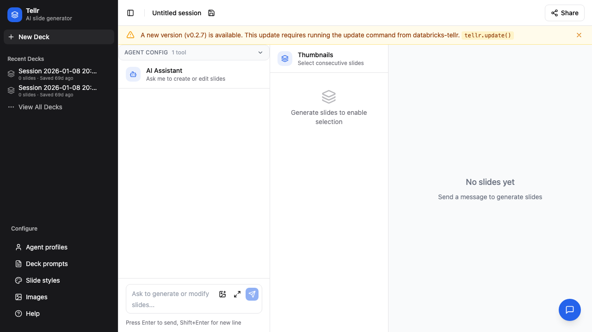
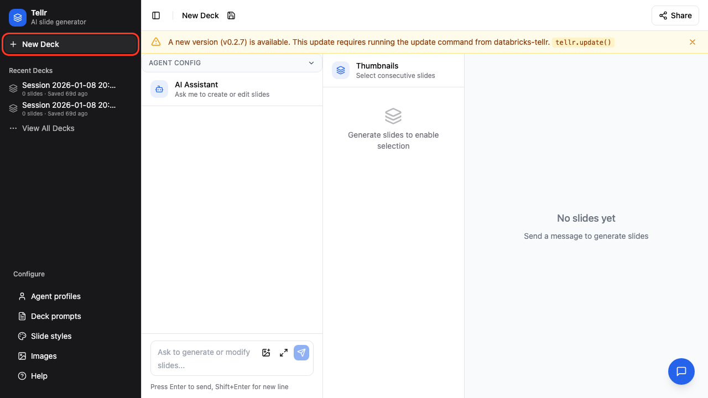
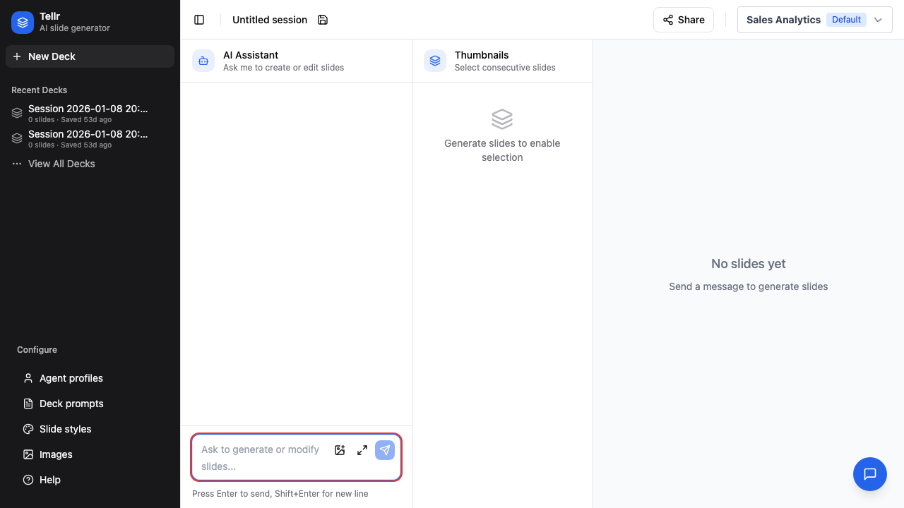
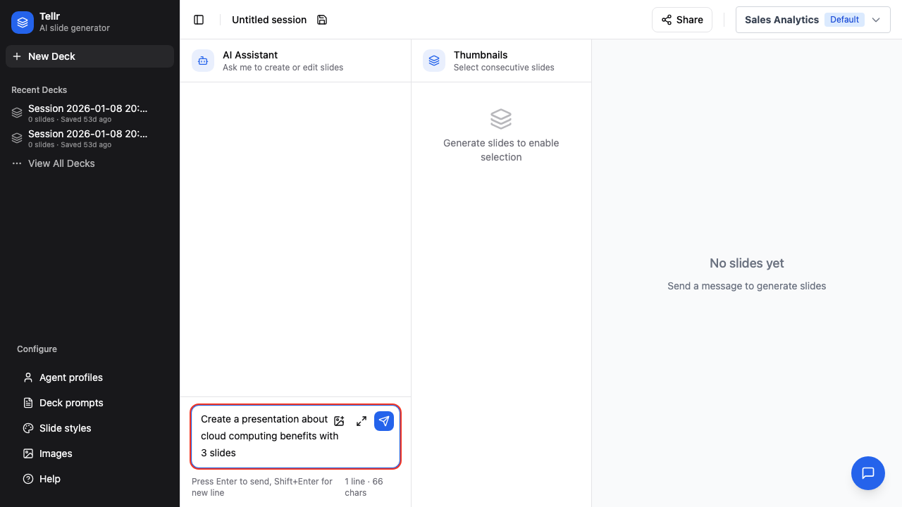
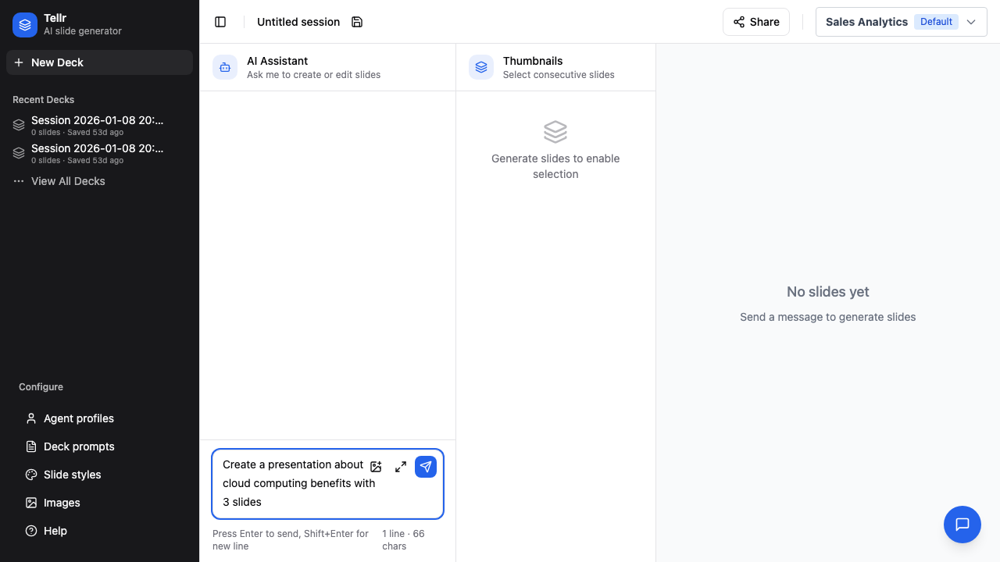

# Generating Slides

This guide walks you through creating AI-generated presentations using Databricks Tellr.

## Overview

The slide generation workflow allows you to:
- Create presentations from natural language prompts
- Pull live data from connected Genie rooms
- Iteratively refine slides through conversation
- Export to PowerPoint, PDF, or HTML

## Prerequisites

- Access to the Databricks Tellr application
- A Genie room with relevant data (optional, for data-driven slides)

## Step-by-Step Instructions

### Step 01: Open the App

Navigate to the application URL. You'll land directly on the slide generator in pre-session mode, ready to start creating.

### Step 02: Configure Tools (Optional)

The AgentConfigBar at the top shows your current tools (Genie spaces, etc.). You can add data sources before or after generating slides. Without any Genie spaces, the agent runs in prompt-only mode.

### Step 03: Enter Your Prompt

Click in the chat input area at the bottom of the screen.

### Step 04: Describe Your Presentation

Type a clear, specific prompt describing what you want:
- Topic and scope
- Number of slides (optional)
- Data to include (if using Genie)
- Any specific requirements

### Step 05: Send Your Request

Click the **Send** button or press Enter to start generation. A session is created automatically on your first message.

## Iterating on Your Slides

After slides are generated, they appear in the right panel. You can see progress in the chat panel as slides stream in.

Refine slides through follow-up messages in the same session:

| Action | Example Prompt |
|--------|----------------|
| Edit slide contents | "Change title to 'Q4 Results'" |
| Add a slide | "Add a new slide about \{X\} after this one" |
| Regenerate all | "Regenerate all slides with more data" |

## Selecting Specific Slides

Click the checkbox on individual slides to select them. Selected slides can be:
- Edited as a group
- Verified for data accuracy

## Returning to a Previous Session

To get back to a previous session, click **My Sessions** in the navigation bar. Any session with slides has a **Restore** button that loads it back into the editor.

## Tips

- **Be specific**: Include topic, audience, and desired outcomes in your prompt
- **Use data queries**: Ask questions about your data, e.g., "Show top 10 customers by revenue"
- **Iterate**: Start simple and refine through follow-up messages
- **Check verification**: Click Verify on slides with data claims to validate accuracy
- **Share your work**: Use the **Share** button to copy a read-only link to your presentation

## Related Guides

- [Saving and Loading Configurations](./02-creating-profiles.md) - Save and reuse configuration snapshots
- [Advanced Configuration](./03-advanced-configuration.md) - Customize prompts and styles
