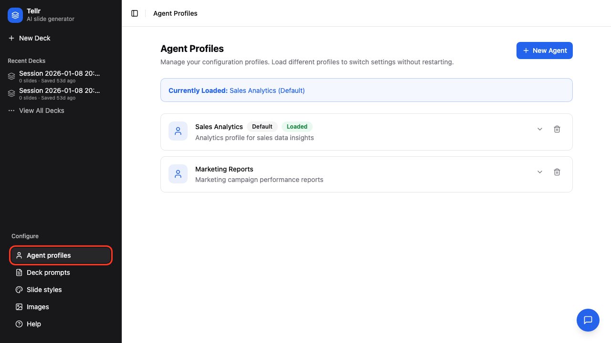
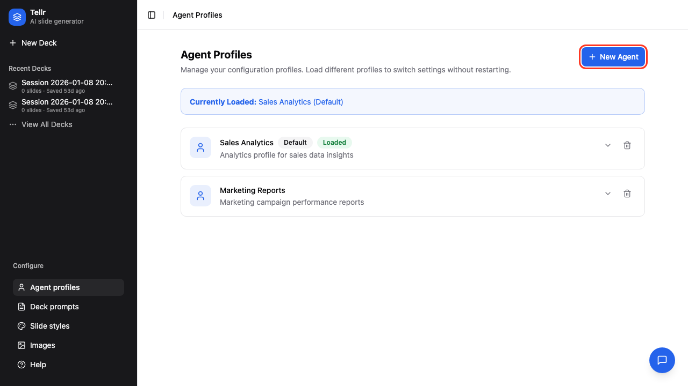
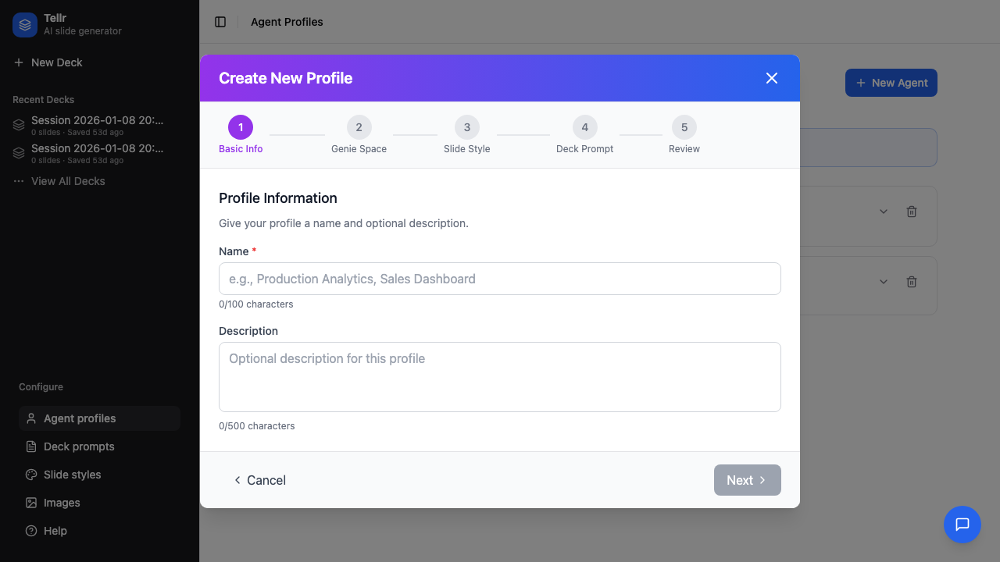
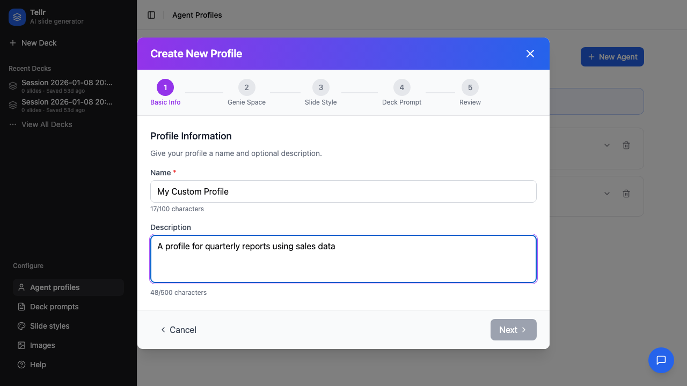
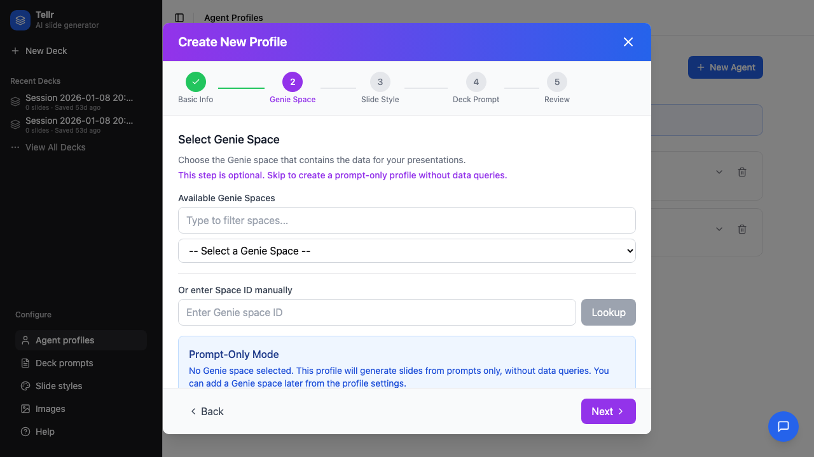
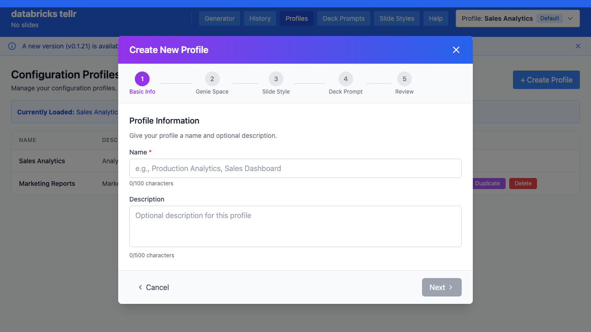
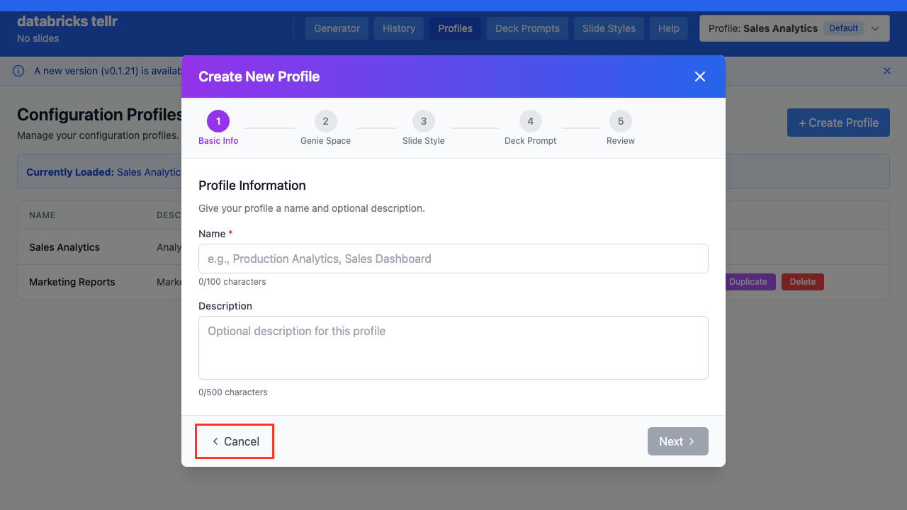
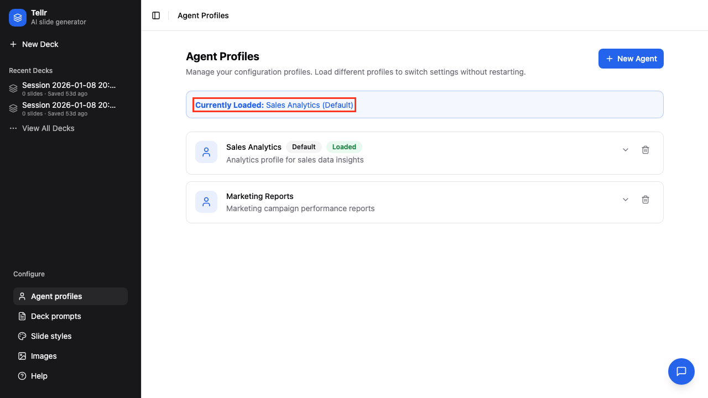
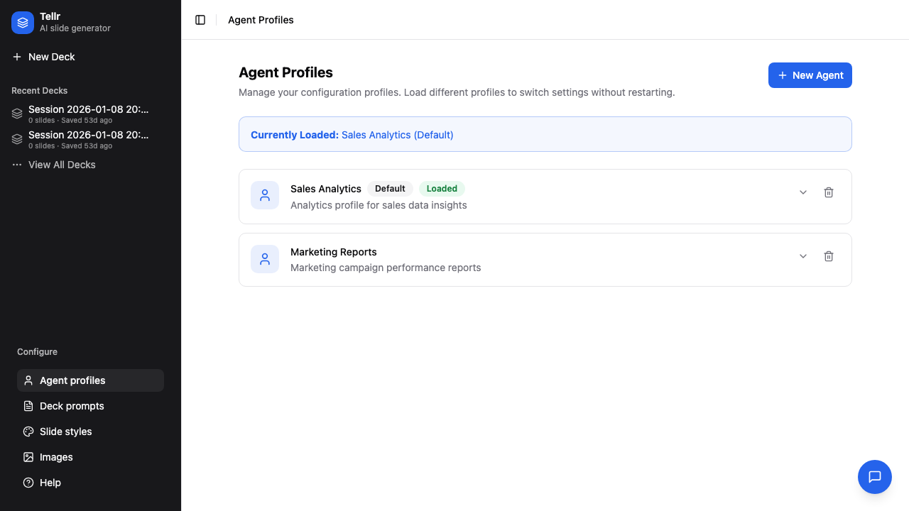
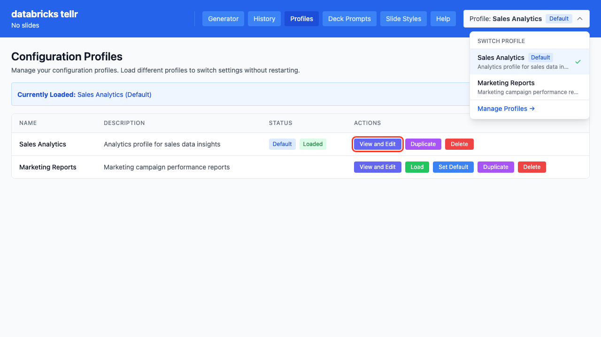

# Creating Profiles

This guide explains how to create and manage configuration profiles in Databricks Tellr.

## Overview

Profiles bundle together:
- **Genie Room** - Your data source for queries
- **Slide Style** - CSS styling for generated slides
- **Deck Prompt** - Template that guides slide structure

Creating profiles for different use cases (e.g., "Quarterly Reviews", "Customer Presentations") allows you to quickly switch contexts.

## Prerequisites

- Access to Databricks Tellr
- Knowledge of available Genie rooms in your workspace
- (Optional) Custom slide styles or deck prompts

## Step-by-Step Instructions

### Step 01: Navigate to Profiles

Click "Profiles" in the navigation bar to open the profile management page.

### Step 02: View Existing Profiles

The page displays all available profiles with their descriptions and settings.

### Step 03: Create New Profile

Click the "+ Create Profile" button to start the creation wizard.

### Step 04: Enter Basic Information

In Step 1 of the wizard, enter:
- **Name** - A unique, descriptive name (required)
- **Description** - What this profile is used for

### Step 05: Complete Basic Details

Fill in both fields with clear, descriptive text.

### Step 06: Connect a Genie Room

In Step 2, connect a Genie room for data access. You have two options:

**Option A: Search by name**
- Type part of the room name
- Select from matching results

### Step 07: Search for Genie Room

Start typing to search for available rooms.

### Step 08: Use Room ID (Alternative)

Switch to the "Enter ID" tab to paste a Genie room ID directly.

### Step 09: Select Slide Style

Choose a slide style that matches your presentation needs.

### Step 10: Select Deck Prompt

Optionally select a deck prompt template to guide slide structure.

### Step 11: Complete or Cancel

Click the final action button to create the profile, or Cancel to exit without saving.

## Editing Profiles

### Step 12: Open Profile Details

Click on any profile card to view its details.

### Step 13: View Details

The detail view shows all profile settings.

### Step 14: Edit Profile

Click the Edit button to modify settings.

## Profile Settings Reference

| Setting | Description | Can Change After Creation |
|---------|-------------|---------------------------|
| Name | Profile identifier | Yes |
| Description | Usage notes | Yes |
| Genie Room | Data source | Yes |
| Slide Style | Visual styling | Yes |
| Deck Prompt | Generation template | Yes |
| Default | Whether this loads on startup | Yes |

## Tips

- **Use descriptive names**: "Q4 Customer Review" is better than "Profile 1"
- **Match prompts to use case**: Different deck prompts suit different presentation types
- **Test with sample prompts**: After creating a profile, generate a test presentation
- **One profile per workflow**: Create separate profiles for different reporting needs

## Related Guides

- [Generating Slides](./01-generating-slides.md) - Use your profile to create presentations
- [Advanced Configuration](./03-advanced-configuration.md) - Create custom prompts and styles
