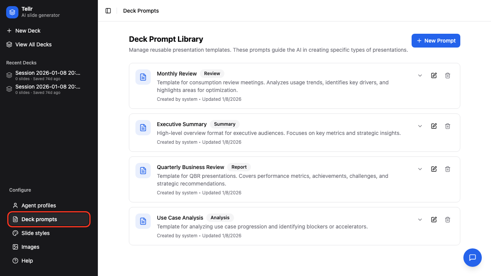
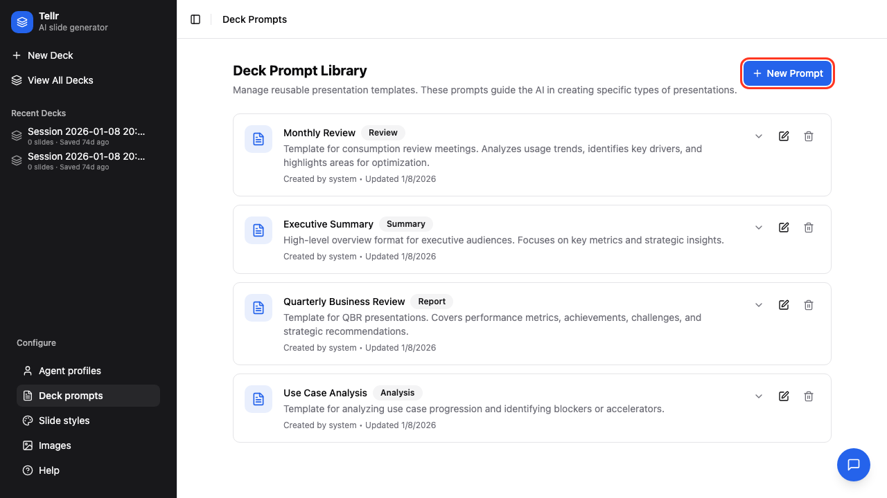
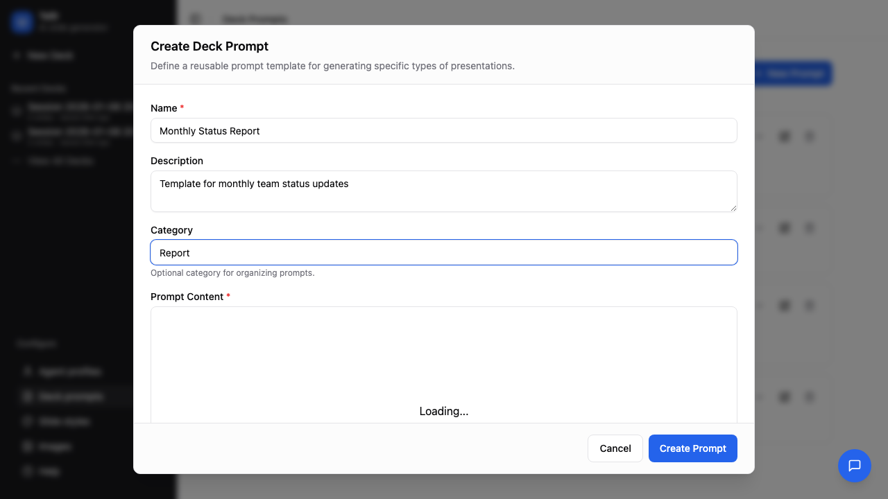
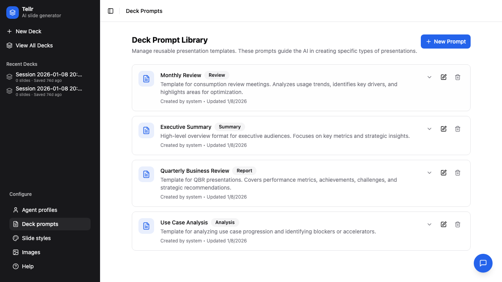
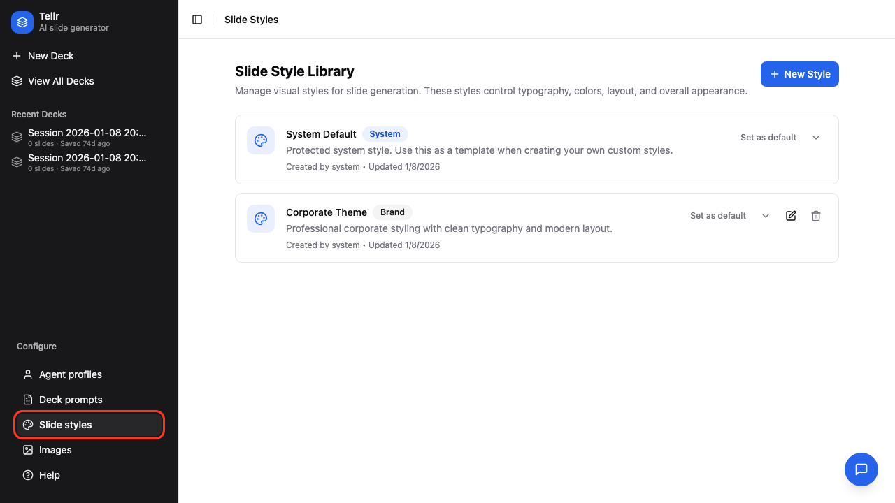
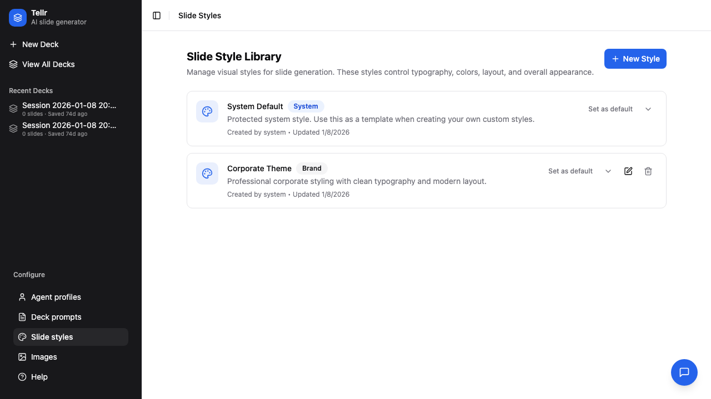
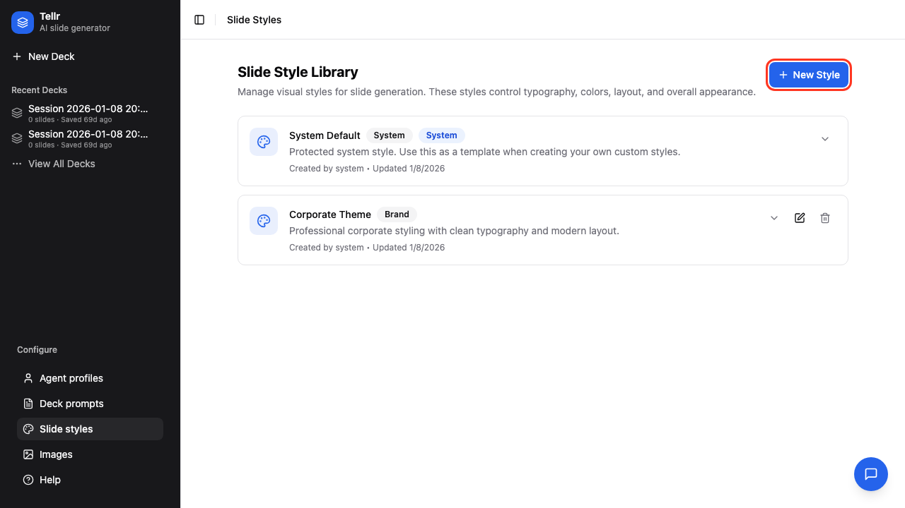
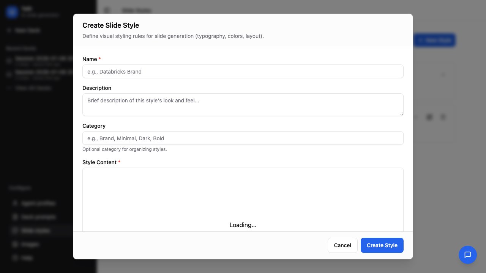
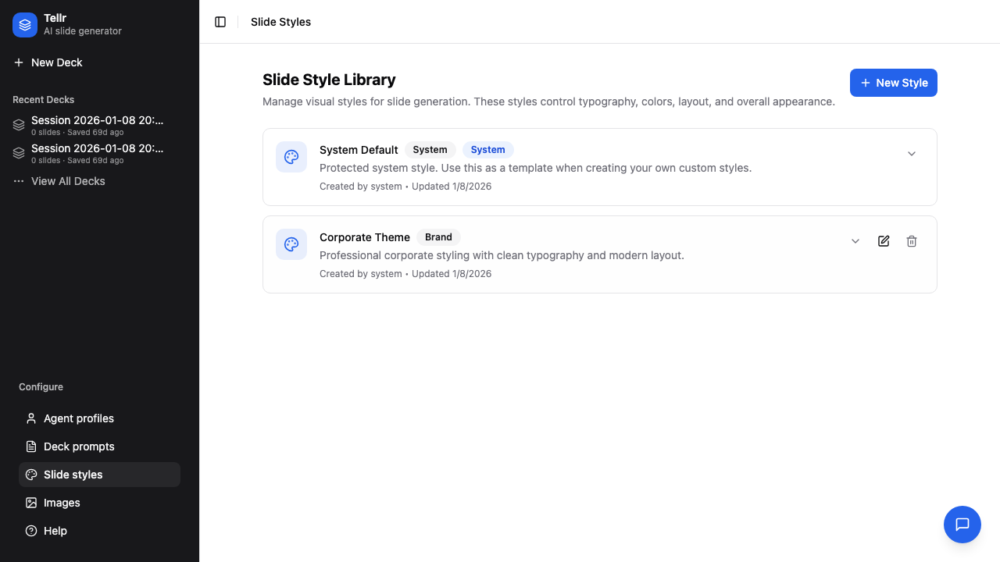
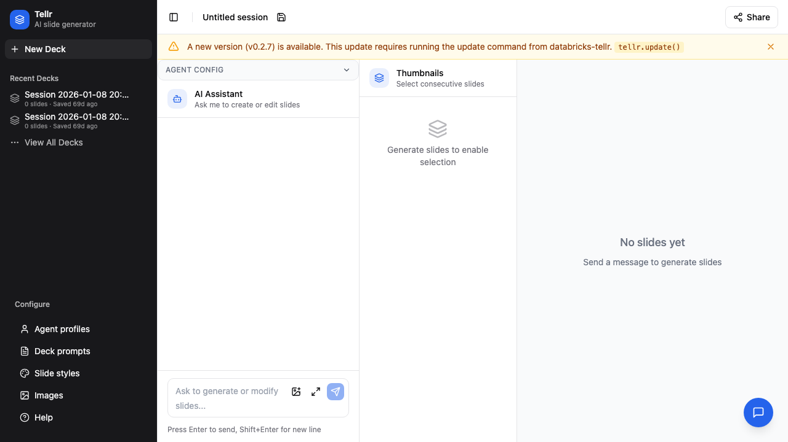

# Advanced Configuration

This guide covers creating and managing Deck Prompts and Slide Styles in Databricks Tellr.

## Overview

Advanced configuration lets you customize:
- **Deck Prompts** - Templates that guide how slides are structured and what content to include
- **Slide Styles** - CSS styling that controls the visual appearance of generated slides

## Prerequisites

- Access to Databricks Tellr
- Understanding of your presentation requirements
- (For styles) Basic CSS knowledge

---

## Part 1: Deck Prompts

Deck prompts are instruction templates that guide the AI when generating slides.

### Step 01: Navigate to Deck Prompts

Click "Deck Prompts" in the navigation bar.



### Step 02: Browse the Library

View existing prompts organized by category.


### Step 03: Create New Prompt

Click "+ Create Prompt" to add a custom prompt.



### Step 04: Prompt Creation Form

The creation form includes:
- **Name** - Unique identifier (required)
- **Description** - What this prompt is for
- **Category** - Organizational grouping
- **Content** - The actual prompt instructions


### Step 05: Fill In Details

Enter clear, descriptive information.



The prompt content should include what type of presentation to create, required sections, tone guidance, and data requirements.

### Step 06: View Prompt Details

Click any prompt to view its full content.



### Step 07: System Prompts

System prompts are protected and cannot be edited. Use them as templates by duplicating.


### Writing Effective Prompts

| Element | Purpose | Example |
|---------|---------|---------|
| Structure | Define slide sequence | "Create 5 slides: title, overview, 3 data slides, summary" |
| Content focus | What to emphasize | "Focus on trends and year-over-year comparisons" |
| Audience | Adjust complexity | "Written for executive stakeholders" |
| Data requirements | What to query | "Include top 5 metrics by category" |
| Formatting | Visual guidance | "Use bullet points, limit to 4 per slide" |

---

## Part 2: Slide Styles

Slide styles are CSS definitions that control how slides look.

### Step 08: Navigate to Slide Styles

Click "Slide Styles" in the navigation bar.



### Step 09: Browse Available Styles

View existing styles with previews.



### Step 10: Create New Style

Click "+ Create Style" to add a custom style.



### Step 11: Style Creation Form

Enter style metadata and CSS content.



### Step 12: Fill In Style Details

Provide a descriptive name and category.


### Step 13: View System Styles

System styles serve as reference implementations.


### Step 14: Corporate Theme Style

The Corporate Theme style applies professional styling and typography.



### CSS Style Guidelines

When creating custom styles, consider:

```css
/* Slide container */
.slide-container {
  padding: 40px;
  font-family: 'Inter', sans-serif;
}

/* Headers */
h1 { color: #1B3A57; font-size: 32px; }
h2 { color: #2D5A7B; font-size: 24px; }

/* Data visualizations */
.chart { max-width: 100%; }
.stat { font-size: 48px; font-weight: bold; }

/* Lists */
ul { margin-left: 20px; }
li { margin-bottom: 8px; }
```

---

## Step 15: Configuration Overview

All configuration pages are accessible from the main navigation.



## System vs Custom Items

| Aspect | System Items | Custom Items |
|--------|--------------|--------------|
| Editing | Not editable | Fully editable |
| Deletion | Cannot delete | Can delete |
| Duplication | Can duplicate | Can duplicate |
| Purpose | Reference templates | Your customizations |

## Tips

- **Start from system items**: Duplicate a system prompt/style as a starting point
- **Test iteratively**: Create slides with your new configuration to verify results
- **Use categories**: Organize prompts and styles by use case or team
- **Document changes**: Use descriptions to note what's customized

## Related Guides

- [Generating Slides](./01-generating-slides.md) - Use your custom configuration
- [Creating Profiles](./02-creating-profiles.md) - Link prompts and styles to profiles
