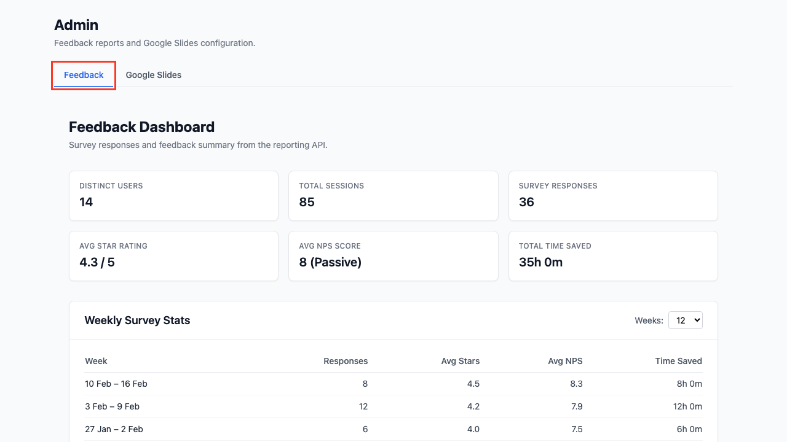
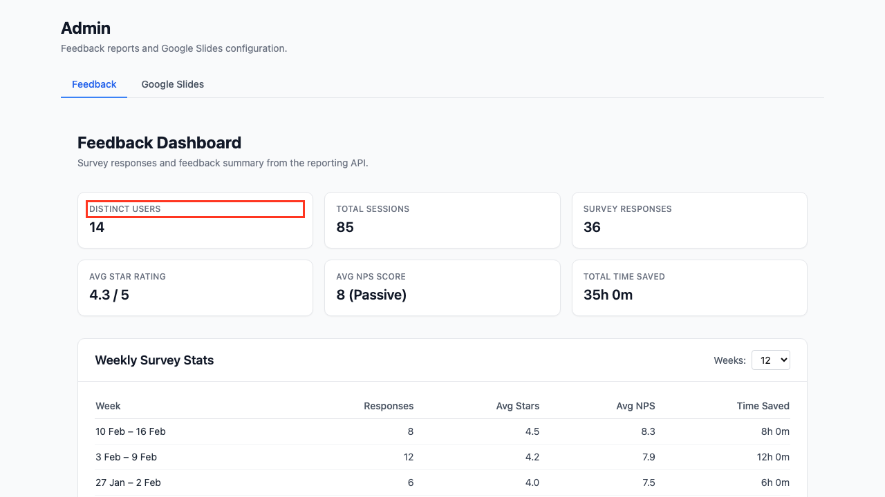
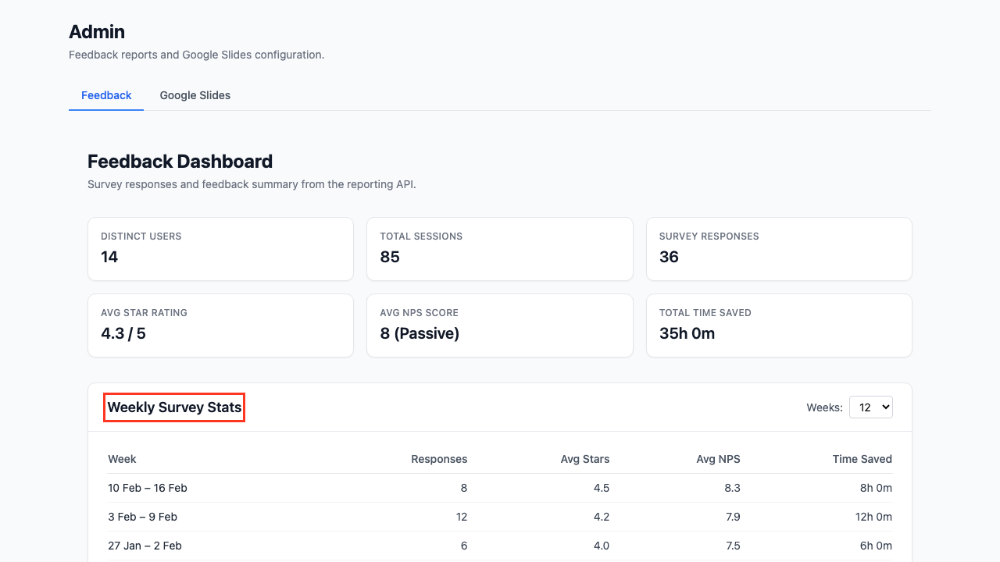
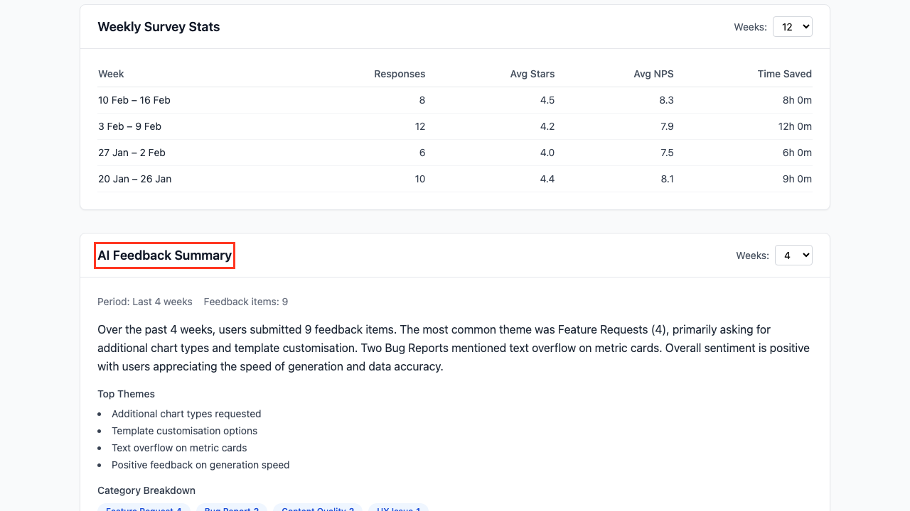

# Retrieving User Feedback

This guide explains how to access and analyse user feedback and satisfaction survey data collected by Tellr.

## Overview

Tellr collects two types of user feedback:

- **Survey responses** — Star ratings (1-5), time-saved estimates, and NPS scores (0-10) from the post-generation satisfaction survey.
- **Feedback conversations** — Structured summaries from the AI feedback widget, categorised by type (Bug Report, Feature Request, UX Issue, Performance, Content Quality, Other) and severity (Low, Medium, High).

Both are stored anonymously in the database. The primary way to view this data is the **Feedback Dashboard** on the Admin page. For programmatic access, a reporting API and direct database queries are also available.

## Prerequisites

- Access to the Tellr application

---

## The Feedback Dashboard

The Admin page includes a Feedback Dashboard that displays aggregated survey metrics and an AI-generated summary of recent feedback.

### Step 01: Open the Admin Page

Navigate to `/admin`. The Feedback tab is selected by default.



### Step 02: Review Summary Metrics

The top of the dashboard shows six summary cards covering the entire reporting period:



| Card | Description |
|------|-------------|
| Distinct Users | Number of unique users who submitted surveys |
| Total Sessions | Total slide generation sessions recorded |
| Survey Responses | Total number of survey submissions |
| Avg Star Rating | Overall satisfaction out of 5 |
| Avg NPS Score | Net Promoter Score average (0-10) |
| Total Time Saved | Cumulative self-reported time savings |

### Step 03: View Weekly Survey Stats

The **Weekly Survey Stats** table breaks down survey responses by week, showing average star rating, average NPS, and time saved per week. Use the **Weeks** dropdown to adjust the time window (4, 8, 12, 26, or 52 weeks).



### Step 04: Read the AI Feedback Summary

The **AI Feedback Summary** section uses an LLM to analyse recent feedback conversations and produce a narrative summary. It includes:

- A natural language summary of themes and common issues
- **Top Themes** — The most frequently mentioned topics
- **Category Breakdown** — Pill-style tags showing the count of feedback items per category

Use the **Weeks** dropdown to adjust the summary period (2, 4, 8, or 12 weeks).



### Understanding NPS Scores

Net Promoter Score classifies respondents into three groups:

| Score | Classification | Meaning |
|-------|---------------|---------|
| 9-10 | Promoter | Enthusiastic, likely to recommend |
| 7-8 | Passive | Satisfied but not enthusiastic |
| 0-6 | Detractor | Unhappy, unlikely to recommend |

NPS = % Promoters minus % Detractors. A positive NPS indicates more promoters than detractors.

---

## Reporting API

For programmatic access or automated reporting, the same data is available via REST endpoints.

### Weekly Stats

```
GET /api/feedback/report/stats?weeks=12
```

Returns weekly aggregated metrics and overall totals. The `weeks` parameter defaults to 12.

```json
{
  "weeks": [
    {
      "week_start": "2026-02-09",
      "week_end": "2026-02-15",
      "responses": 15,
      "avg_star_rating": 4.3,
      "avg_nps_score": 8.1,
      "total_time_saved_minutes": 960,
      "time_saved_display": "16h 0m"
    }
  ],
  "totals": {
    "total_responses": 87,
    "avg_star_rating": 4.2,
    "avg_nps_score": 7.8,
    "total_time_saved_minutes": 5400,
    "time_saved_display": "90h 0m"
  },
  "usage": {
    "total_sessions": 142,
    "distinct_users": 23
  }
}
```

### AI Summary

```
GET /api/feedback/report/summary?weeks=4
```

Returns an LLM-generated narrative summary. The `weeks` parameter defaults to 4.

```json
{
  "period": "Last 4 weeks",
  "feedback_count": 12,
  "summary": "Over the past 4 weeks, users submitted 12 feedback items...",
  "top_themes": ["Template customisation", "Chart formatting"],
  "category_breakdown": {"Feature Request": 5, "Bug Report": 3, "UX Issue": 2}
}
```

---

## Direct Database Queries

For advanced analysis, query the database tables directly.

### Survey Responses

```sql
SELECT star_rating, time_saved_minutes, nps_score, created_at
FROM survey_responses
ORDER BY created_at DESC
LIMIT 50;
```

### Feedback Conversations

```sql
SELECT category, severity, summary, created_at
FROM feedback_conversations
ORDER BY created_at DESC
LIMIT 50;
```

### Example: Monthly NPS Breakdown

```sql
SELECT
  DATE_TRUNC('month', created_at) AS month,
  COUNT(*) AS responses,
  ROUND(AVG(nps_score), 1) AS avg_nps,
  COUNT(CASE WHEN nps_score >= 9 THEN 1 END) AS promoters,
  COUNT(CASE WHEN nps_score BETWEEN 7 AND 8 THEN 1 END) AS passives,
  COUNT(CASE WHEN nps_score <= 6 THEN 1 END) AS detractors
FROM survey_responses
WHERE nps_score IS NOT NULL
GROUP BY DATE_TRUNC('month', created_at)
ORDER BY month DESC;
```

---

## Tips

- **Start with the dashboard** — The Admin page gives you an at-a-glance view without needing API tools
- **Adjust time windows** — Use the Weeks dropdowns to focus on recent trends or longer-term patterns
- **Automate weekly reports** — Call `GET /api/feedback/report/stats` from a scheduled job and post results to Slack or email
- **Time savings ROI** — Multiply total time saved by an average hourly rate to quantify ROI in monetary terms
- **Combine stats and summary** — Use the stats endpoint for numbers and the summary endpoint for qualitative insights in management reports

## Related Guides

- [Generating Slides](./01-generating-slides.md) — The workflow that triggers the satisfaction survey
- [Exporting to Google Slides](./07-exporting-to-google-slides.md) — The Admin page also hosts Google Slides configuration
- [Advanced Configuration](./03-advanced-configuration.md) — Configure profiles and styles
