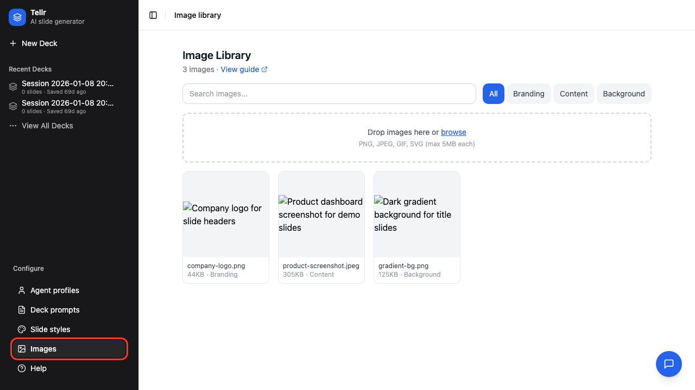
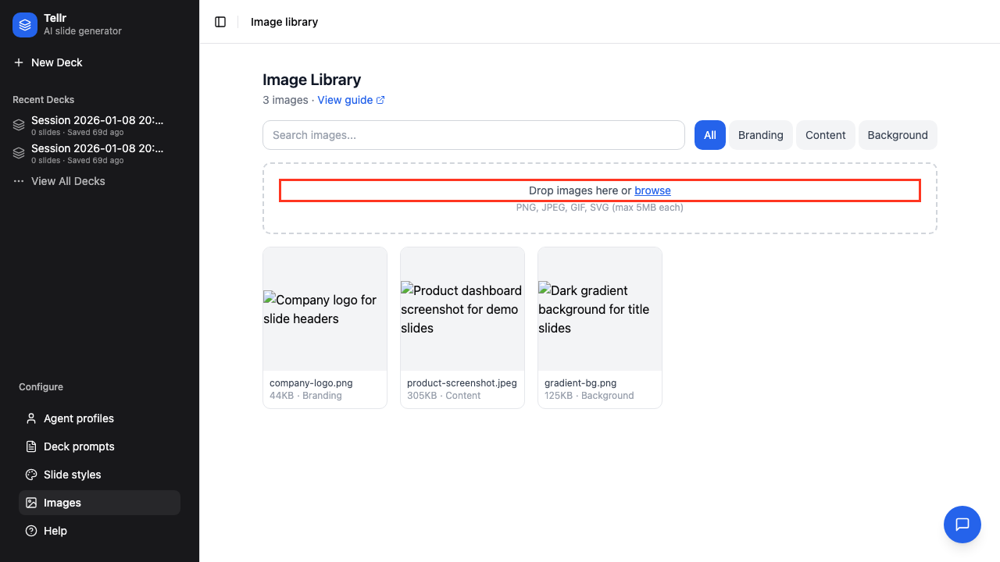
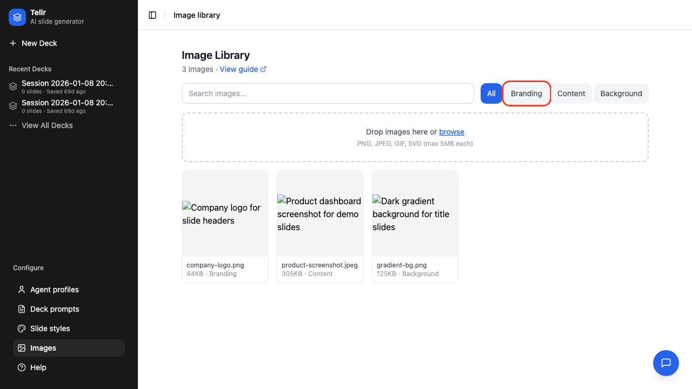
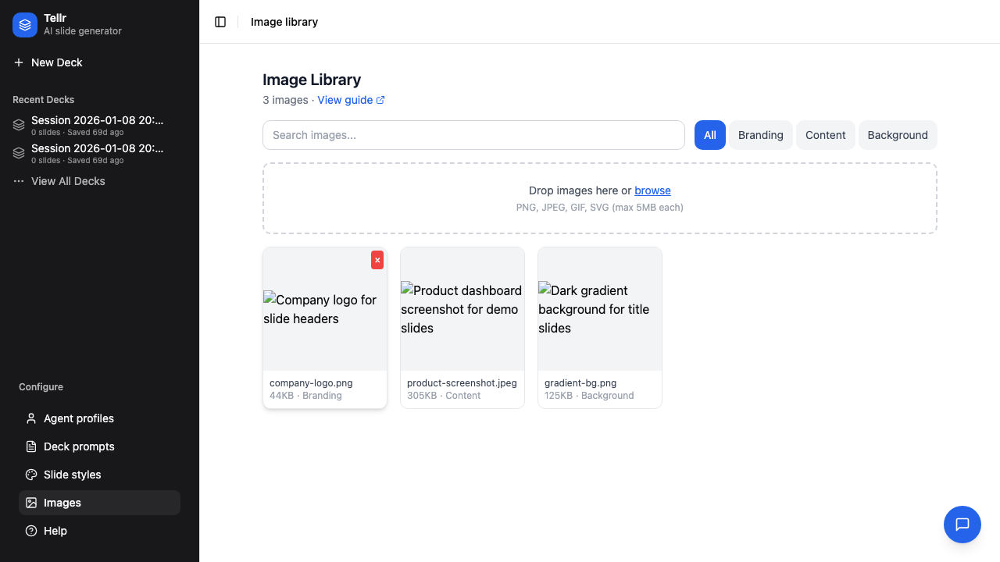
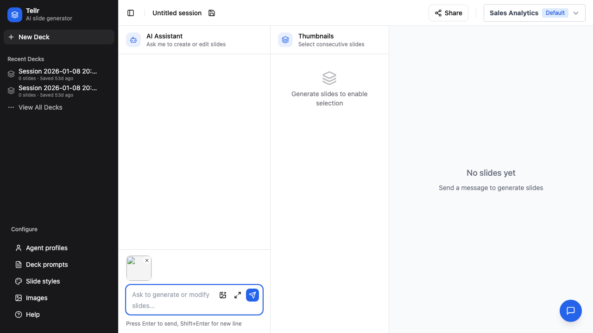
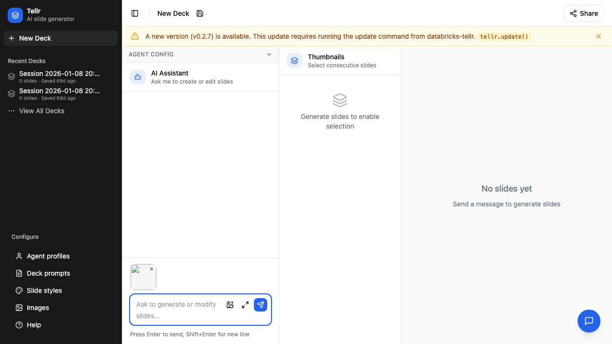
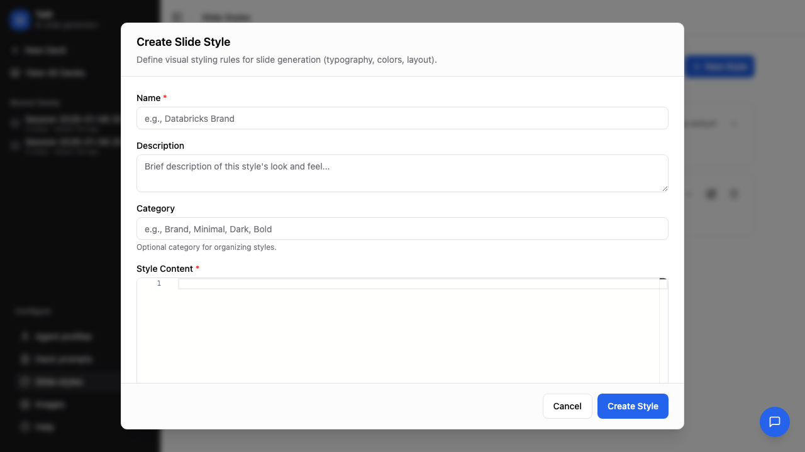

# Uploading Images

This guide covers how to upload, organise, and use images in your AI-generated presentations.

## Overview

Tellr includes an image library that stores images in the database. You can:
- Upload logos, backgrounds, and content images for use across all profiles
- Paste images directly into the chat to include them in a conversation
- Configure image guidelines so the AI places specific images automatically

## Prerequisites

- Access to the Databricks Tellr application
- Image files in PNG, JPEG, GIF, or SVG format (max 5 MB each)

---

## Part 1: The Image Library

### Step 01: Open the Image Library

Click **Images** in the navigation bar to open the image library. The library displays all uploaded images in a grid with thumbnails.



### Step 02: Upload Images

Drag and drop files onto the upload area, or click **browse** to select files. You can upload multiple files at once — they are processed sequentially with a progress indicator.



**Upload constraints:**

| Constraint | Value |
|-----------|-------|
| Max file size | 5 MB |
| Allowed formats | PNG, JPEG, GIF, SVG |
| Filename uniqueness | Must be unique (case-insensitive) among active images |

If some files fail validation (wrong type, too large, or duplicate name), the successful uploads are kept and per-file errors are displayed together.

### Step 03: Filter by Category

Use the category buttons to filter the library view. Categories help organise images by purpose.



| Category | Purpose |
|----------|---------|
| `branding` | Logos and brand assets |
| `content` | General content images |
| `background` | Slide background images |

### Step 04: View and Edit Image Details

Click an image card to view its metadata. You can edit the description, tags, and category.



- **Tags** — JSON array of keywords (e.g. `["logo", "brand"]`) used by the AI when searching for images
- **Description** — Free text describing the image, also used by the AI search
- **Category** — One of `branding`, `content`, or `background`
- **Delete** — Soft-deletes the image (frees the filename for reuse)

---

## Part 2: Paste-to-Chat

### Step 05: Paste an Image into Chat

You can paste an image directly from your clipboard into the chat input. The image uploads immediately and appears as an attachment preview.



### Step 06: Save to Library Toggle

When you paste an image, a **Save to library** checkbox controls whether it persists:

- **Checked** — The image is saved to the library with a standard category and appears in the grid
- **Unchecked** — The image is marked as `ephemeral` and hidden from the default library view



When you send the message, the attached image IDs are included in the request. The AI receives the image metadata and can reference the images in the slides it generates.

---

## Part 3: Image Guidelines in Slide Styles

Image guidelines let you configure a slide style so the AI automatically places specific images (such as a company logo) without the user having to ask each time.

### Step 07: Open the Image Guidelines Editor

Navigate to **Slide Styles**, then create or edit a style. The form includes a dedicated **Image Guidelines** section with a Monaco editor.


### Step 08: Insert Image References

Click the **Insert Image Ref** button to open the image picker and insert an `{{image:ID}}` reference at the cursor position.



Write guidelines in natural language referencing image IDs. For example:

```
Place {{image:5}} as a logo in the top-right corner of every slide.
Use {{image:12}} as the background for the title slide.
```

When image guidelines are populated, the AI uses the referenced images automatically on every generation. When the field is empty, the AI only searches for images when explicitly asked by the user.

---

## How the AI Uses Images

Understanding how images flow through the system helps you write better prompts and guidelines:

1. The AI has a `search_images` tool that returns image metadata (ID, filename, description, tags) — it never receives raw image data
2. The AI outputs `{{image:ID}}` placeholders in the slide HTML
3. The backend substitutes placeholders with embedded image data before the frontend receives the slides
4. If an image ID is invalid, the placeholder remains in the HTML (graceful degradation)

## Tips

- **Use descriptive tags and descriptions** — The AI searches images by filename, description, and tags, so detailed metadata produces better results
- **Organise by category** — Use `branding` for logos, `content` for charts and diagrams, `background` for slide backgrounds
- **Image guidelines for consistency** — If every presentation needs a logo, add it to the slide style's image guidelines rather than asking each time
- **Paste for one-off images** — Use paste-to-chat for images relevant to a single conversation; uncheck "Save to library" to keep the library clean

## Related Guides

- [Generating Slides](./01-generating-slides.md) — Use images in your slide generation workflow
- [Advanced Configuration](./03-advanced-configuration.md) — Manage slide styles where image guidelines are configured
- [Creating Custom Styles](./05-creating-custom-styles.md) — CSS reference for styling slides that include images
