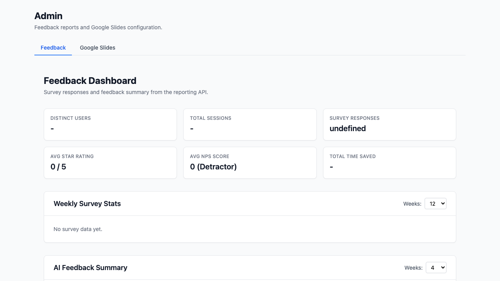
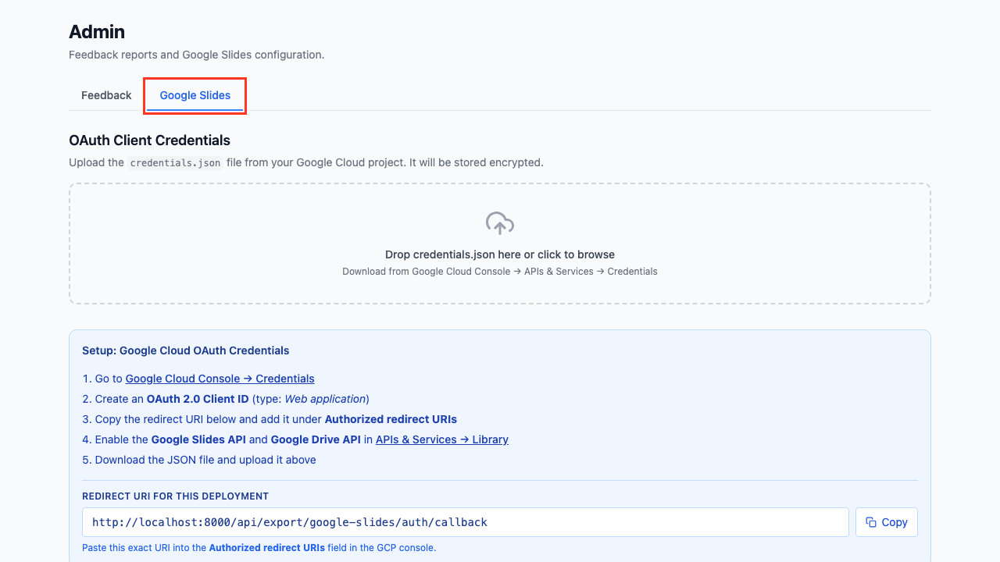
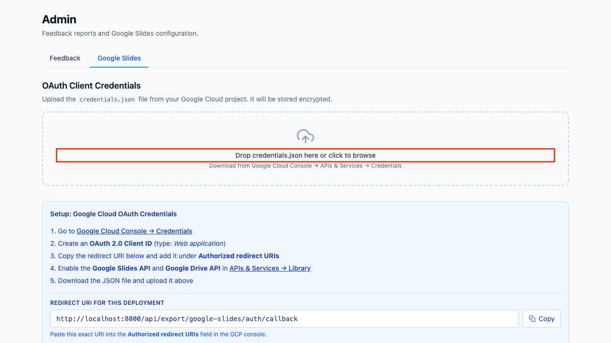
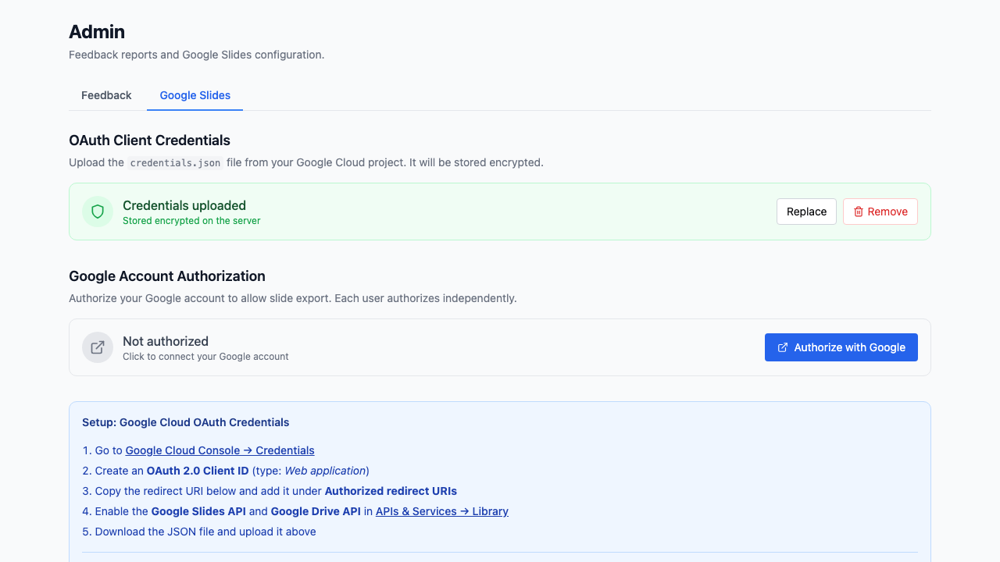
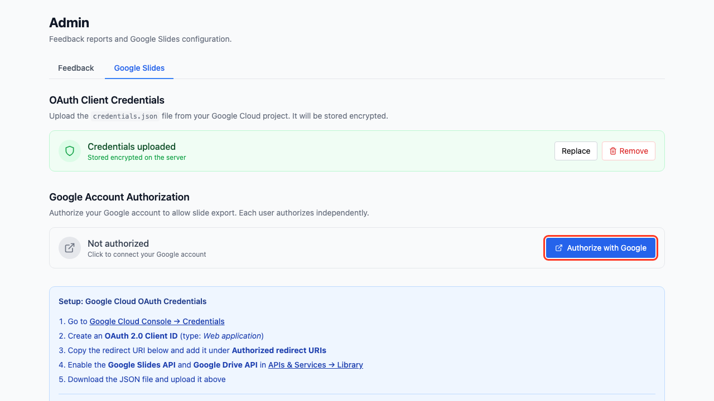
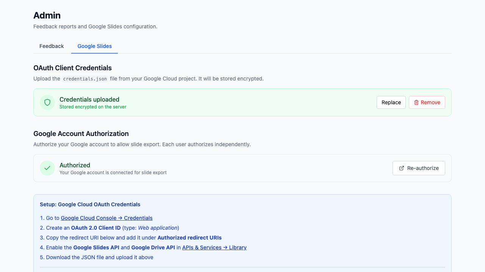
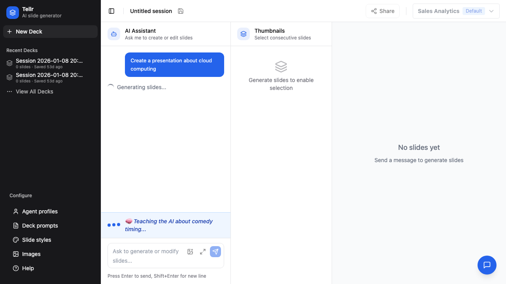
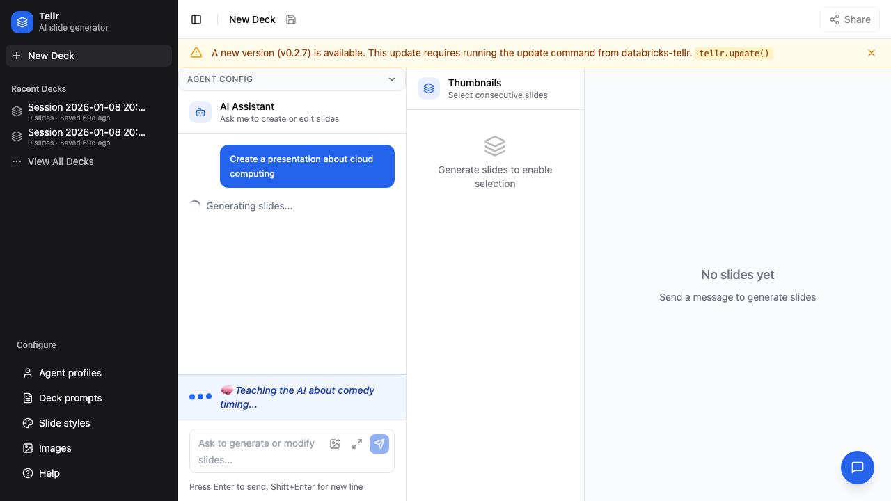

# Exporting to Google Slides

This guide covers how to set up Google Slides integration and export your AI-generated presentations to Google Slides.

## Overview

The Google Slides export creates an editable Google Slides presentation from your generated deck. It uses an LLM to convert each slide's HTML into Google Slides API calls, producing a cloud-native presentation you can share and edit in Google Workspace.

## Prerequisites

- Access to the Databricks Tellr application
- A Google Cloud project with the Google Slides API and Google Drive API enabled
- Admin access to upload OAuth credentials (one-time setup)
- A generated slide deck to export

---

## Part 1: Admin Setup (One-Time)

An administrator must upload Google OAuth credentials before any user can export. This only needs to be done once for the entire application.

### Step 01: Open the Admin Page

Navigate to the `/admin` URL or click **Admin** in the navigation. The admin page has tabs for different settings.



### Step 02: Go to the Google Slides Tab

Click the **Google Slides** tab to see the credentials and authorization configuration.



### Step 03: Obtain OAuth Credentials

Before uploading, you need a `credentials.json` file from Google Cloud Console:

1. Go to [Google Cloud Console](https://console.cloud.google.com/)
2. Create a project (or select an existing one)
3. Enable the **Google Slides API** and **Google Drive API**
4. Go to **Credentials** and create an **OAuth 2.0 Client ID** (Desktop app)
5. Download the `credentials.json` file

### Step 04: Upload Credentials

Drag and drop the `credentials.json` file onto the upload area, or click to browse. The file is validated, encrypted, and stored in the database.



Once uploaded, the status indicator changes to confirm the credentials are configured.



---

## Part 2: Per-User Authorization

Each user must authorize once to link their Google account. Tokens are stored per-user and auto-refresh.

### Step 05: Authorize with Google

Click the **Authorize with Google** button. A popup opens with the Google OAuth consent screen.



### Step 06: Complete Authorization

After granting consent in the popup, the authorization status updates to confirm your account is linked.



Authorization is independent of profiles — it applies to your user account across the entire application.

---

## Part 3: Exporting a Deck

### Step 07: Open the Export Menu

With slides generated in a session, click the **Export** button in the slide panel to open the export dropdown.



### Step 08: Select Google Slides

Click **Export to Google Slides** to start the export.



The backend creates a blank Google Slides presentation, then converts each slide using the LLM. When complete, a link to the new presentation appears. Click it to open and edit in Google Slides.

---

## How the Export Works

1. The frontend sends the session ID and any chart images to the export endpoint
2. The backend builds an authenticated Google API client using the admin credentials and your user token
3. A blank presentation is created via the Google Slides API
4. Each slide's HTML is sent to the LLM, which generates Python code calling the Google Slides `batchUpdate` API
5. The generated code is executed server-side for each slide
6. If a slide fails to convert, the system retries once with error context, then falls back to a placeholder text box

## Troubleshooting

| Problem | Cause | Solution |
|---------|-------|----------|
| "Not authorized" after previously working | Token expired or encryption key changed | Click **Authorize with Google** again |
| Export fails for a single slide | LLM-generated code error | The slide gets a placeholder; other slides are unaffected |
| "Credentials not configured" | Admin hasn't uploaded `credentials.json` | Ask an admin to upload credentials on the `/admin` page |
| App won't start in production | Missing `GOOGLE_OAUTH_ENCRYPTION_KEY` env var | Set the environment variable (see below) |

### Production Encryption Key

In production, the `GOOGLE_OAUTH_ENCRYPTION_KEY` environment variable must be set. Generate one with:

```bash
python -c "from cryptography.fernet import Fernet; print(Fernet.generate_key().decode())"
```

In local development, a key is auto-generated and persisted to `.encryption_key` (gitignored).

## Tips

- **Export after finalising** — Export once you're satisfied with the slides, since each export creates a new presentation
- **Chart images are included** — Any charts rendered on the slides are captured and embedded in the Google Slides export
- **Slides are 16:9** — The exported presentation uses widescreen dimensions (10" x 5.625")
- **Edit freely in Google** — The export produces native Google Slides elements, not images, so text and shapes are fully editable

## Related Guides

- [Generating Slides](./01-generating-slides.md) — Create the slide deck before exporting
- [Advanced Configuration](./03-advanced-configuration.md) — Configure profiles and styles
